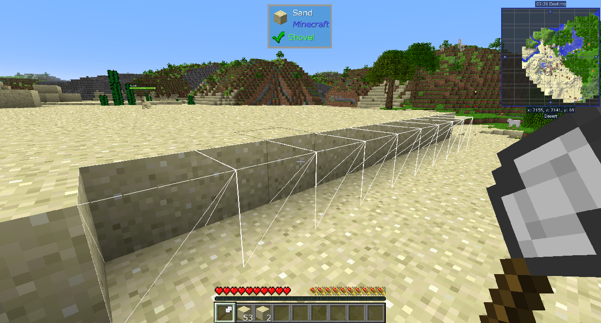
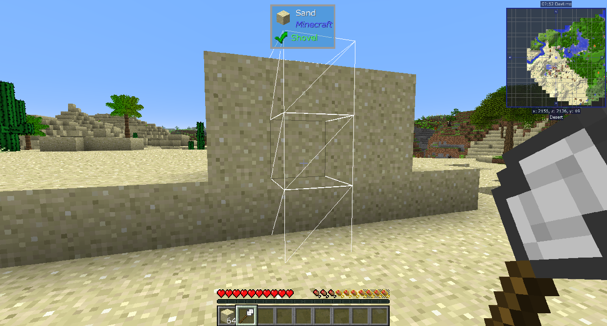
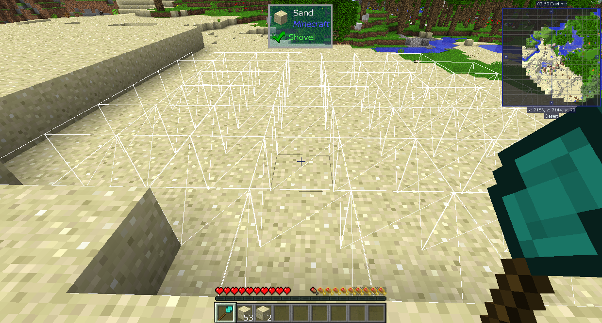

# 更好的建築法杖-Better Builder's Wands

Better Builder's Wands 添加了多種工具，讓您可以更輕鬆地放置方塊。更高等級的法杖可以同時放置更多的方塊，也可以將它們放置在更多的地方。
法杖只能放置它們正在使用的表面方塊。這意味著如果您在「沙子」上單擊它們，它們將放置「沙子」。這使它們非常適合擴展表面或填充孔洞。

石質手杖最多可以在其他方塊的側面，水平放置 5 個方塊。

鐵質手杖最多可以在其他方塊的側面，垂直或水平放置 9 個方塊。

鑽石手杖最多可放置 1561 個方塊，擴展方塊的整個連接面。它可以用於方塊的任何一側，包括頂部和底部。

永恆手杖有 3 個等級，每個層級都可以放置上一層的兩倍。它們具有無限的耐用性，其他功能與鑽石手杖相同。