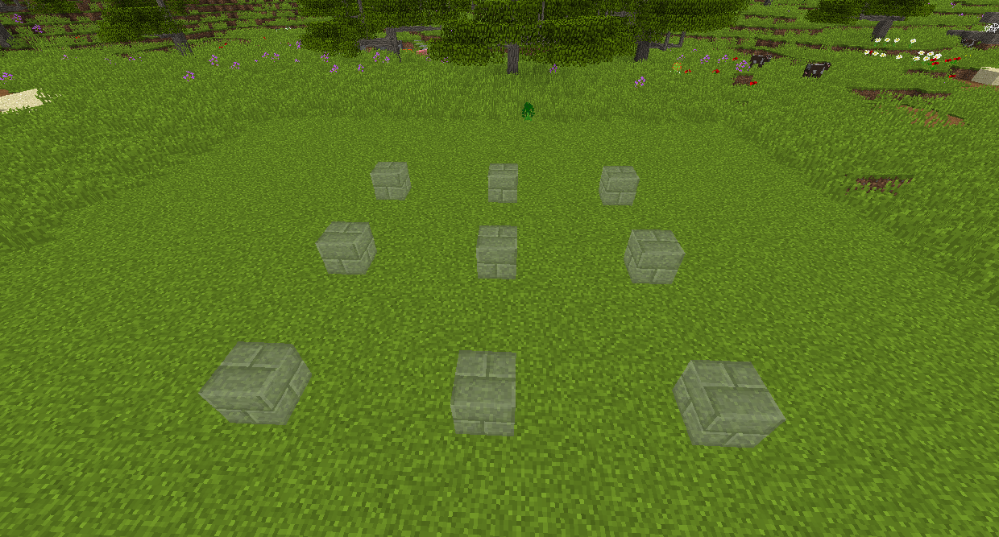
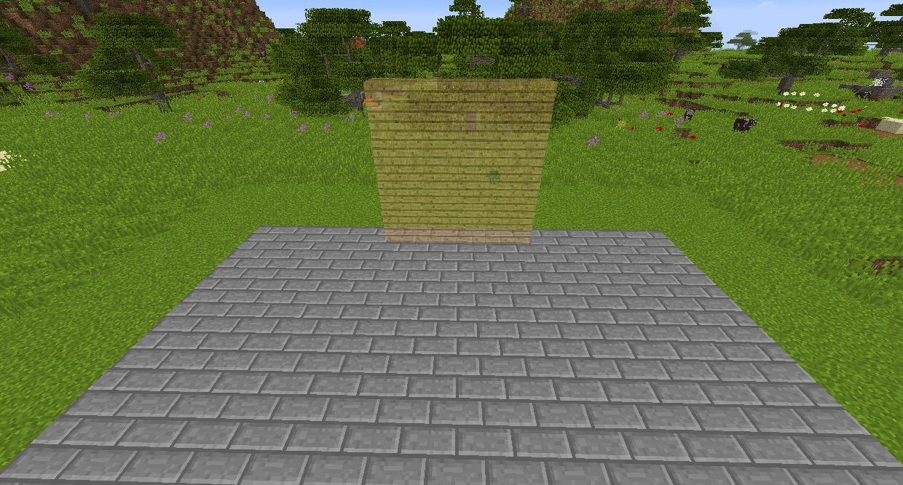
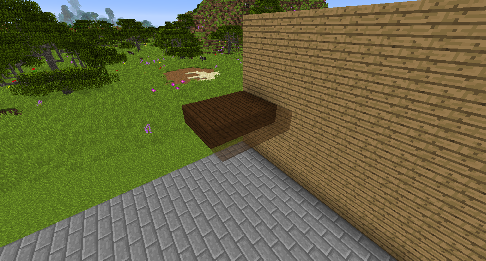
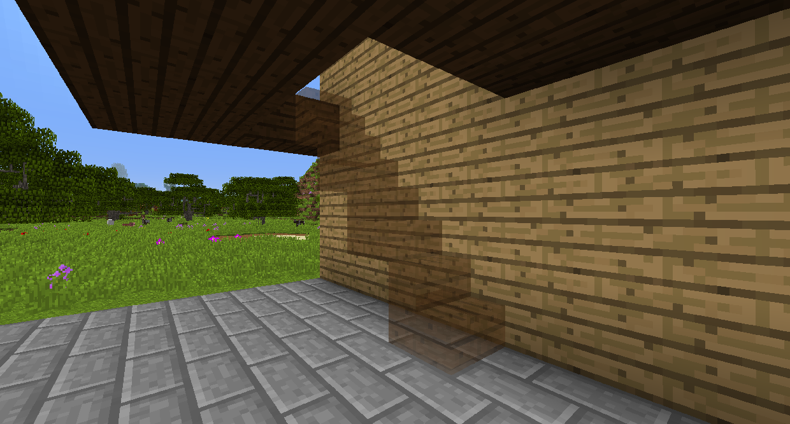

# 建築小幫手

建築小幫手可讓您快速建構簡單的結構，如牆壁和樓梯。
潛行右鍵單擊一個方塊以設置小工具來構建該方塊，然後右鍵單擊以建造全息圖顯示的位置。

建築模式

Build to Me 模式將嘗試從您指向您的位置製作一條直線。

網格模式將使您在範圍定義的區域中設置的方塊形成網格。

垂直牆面模式將創建一面牆，每條邊的長度由範圍定義。

水平牆面模式將創建一個平面，其長度由範圍定義。

表面模式將在您正在查看的類型的每個方塊上放置方塊，其面積取決於範圍。此模式有其他選項。 啟用模糊模式將允許它在所有相似的方塊上工作，而不是完全相同的方塊，因此例如不同的木材類型將被視為同一個方塊。連結面將要求所有方塊都接觸才能放置它們。

樓梯模式會將方塊斜向下或向上放置，具體取決於您是在方塊上方還是下方。

水平列模式將在您正在查看的方塊的另一側放置一行塊。

垂直柱模式將垂直向上或向下放置一個方塊柱。