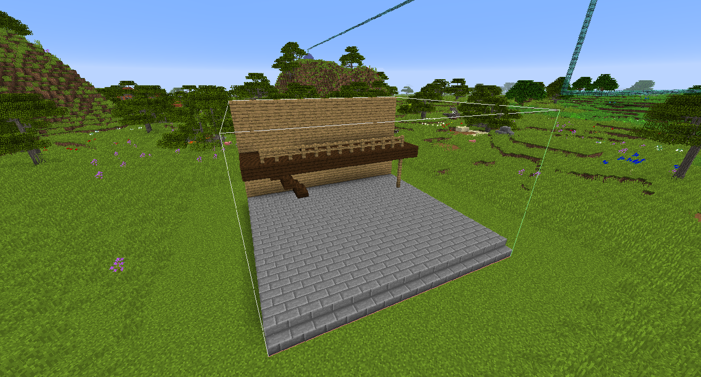
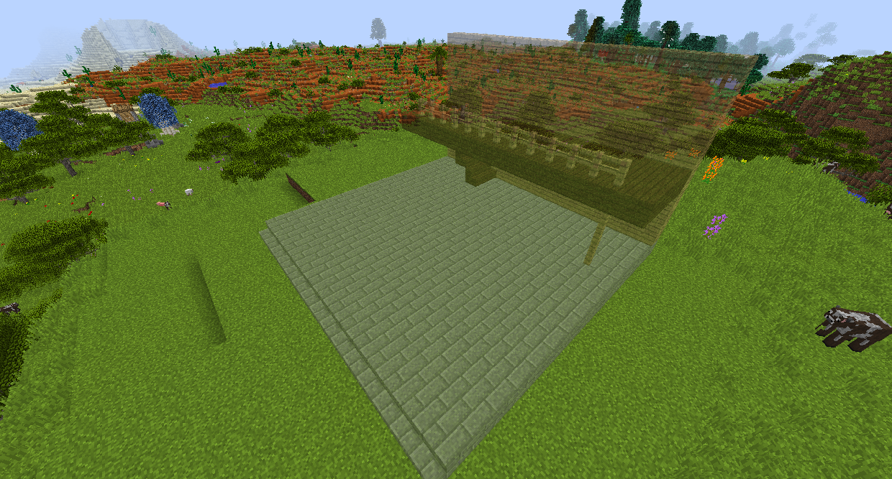

# 複製-黏貼小幫手

複製-黏貼小幫手將允許您複製一個區域並將其放置在其他地方，而不會破壞原始區域。您還可以放置其他人在線製作的結構！

右鍵單擊要複製的區域的一角。這個方塊是以後放置它的地方。潛行右鍵單擊另一個角以復制它們之間的矩形區域。

按住 G 然後更改為粘貼模式，您將看到您複製的塊的全息圖。您可以將其錨定在某處，然後按住潛行並右鍵單擊以手動調整結構的位置（如果它完全關閉）。

您可以將結構保存到模板。
如果您不想獲得結構的所有方塊，則可以使用構建漿糊代替！