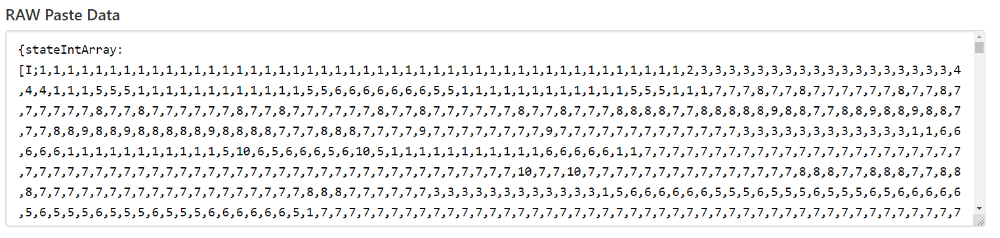

# Templates

模板允許您將複製的結構保存到項目中，以便您可以保存它們，以便以後粘貼它們。

顧名思義，模板管理器是您管理模板的地方。

將小幫手在左側插槽中，將紙張或模板放在右側插槽中。
單擊保存將小幫手中的結構數據寫入紙張，創建模板。您還可以覆蓋模板而不是使用紙張。
單擊加載將模板中的結構數據寫入小工具，允許您將其粘貼到世界中。

單擊複製將小工具中的結構數據複製到電腦的剪貼板。 您可以在網路上發布此內容或將其發送給遊戲外的某人，他們可以加載它。
單擊粘貼將結構數據從電腦剪貼板粘貼到右側插槽中的紙張或模板，以便您可以將其加載到小工具中。
[您還可以在這裡找到網路上其他人製作的結構！](https://www.reddit.com/r/9x9/)
瀏覽該頁面並找到您喜歡的結構並打開它所在的帖子。帖子應該有一個鏈接 pastebin.com，底部應該是一個文本框，上面寫著“RAW Paste Data”。選擇框中的所有內容並複制它。
