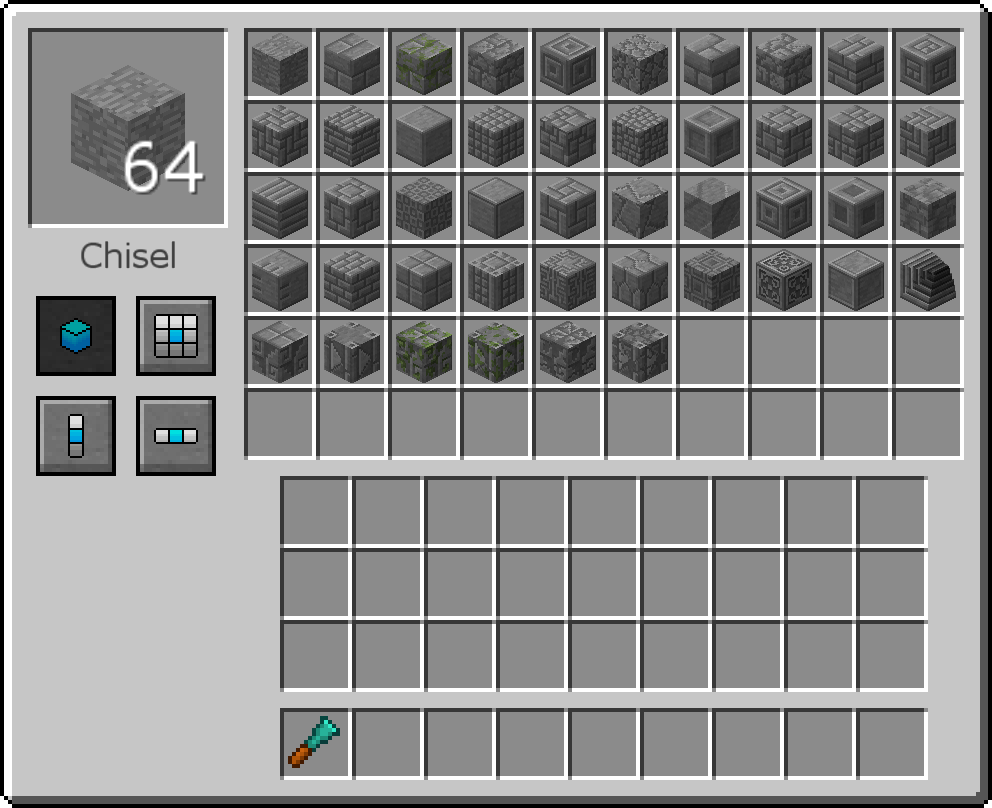

# 鑿子-Chisel

Chisel 模組添加了大量裝飾方塊，以及 4 種幫助製作它們的工具。

第一個鑿子是最基本的。打開它，放入一個方塊，在右邊你可以取出你想要的版本。如果你在輸入槽裡放了一個鑿好的方塊，你可以左鍵點擊世界中方塊上的鑿子來鑿掉它們，而不必打破和更換它們。

鑽石鑿子使用壽命更長，有更多的鑿塊選項。 通過左側的4個按鈕，您可以選擇同時鑿出一個方塊、一個3x3區域、3個垂直方塊或3個水平方塊。

i鑿子的工作原理略有不同。不是插入方塊並取出鑿好的方塊，而是從物品欄中選擇要鑿的塊，然後在右側選擇要將其變成的方塊。在左側，您可以看到方塊的外觀。您可以通過按下面的按鈕來更改方塊的形狀。 您可以單擊鑿子鑿出您選擇的堆棧，或者潛行並單擊鑿子一次鑿物品欄中的所有該類型的塊。也有更多的鑿塊選項。

一些方塊具有生成多個塊的紋理(multiblock)。但是，它們可能不會集中在您希望它們所在的位置。 終界紋理平移手杖可以幫助解決這個問題。

握住終界紋理平移手杖並查看方塊。在要移動紋理的方向上單擊它。因此，如果紋理高一格，請單擊該格的底部。

自動雕鑿機會自動鑿出您插入其中的方塊。將鑿子放入中間槽，將您想要的方塊版本放入中間底部槽中，然後將方塊輸入左側，它們將輸出到右側。

