# 製作工具

首先，您需要製作這些物品。

合成站的工作方式與普通的合成台類似，但如果您在退出GUI前將物品放在裡面，物品將會留在裡面。 您還可以在左側看到接觸它的物品欄以及所有其他匠魂的工作台作為選項卡。
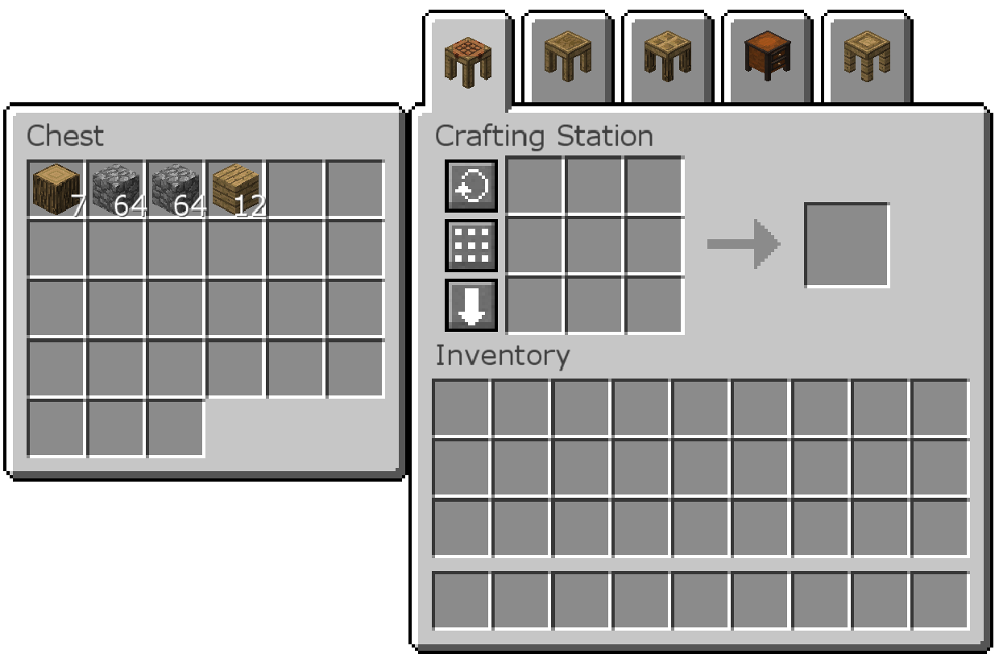

模具桌將空白模具轉換為製作工具所需的零件模具。將空白模具放入左側插槽，然後在左側單擊所需的零件模具以製作。
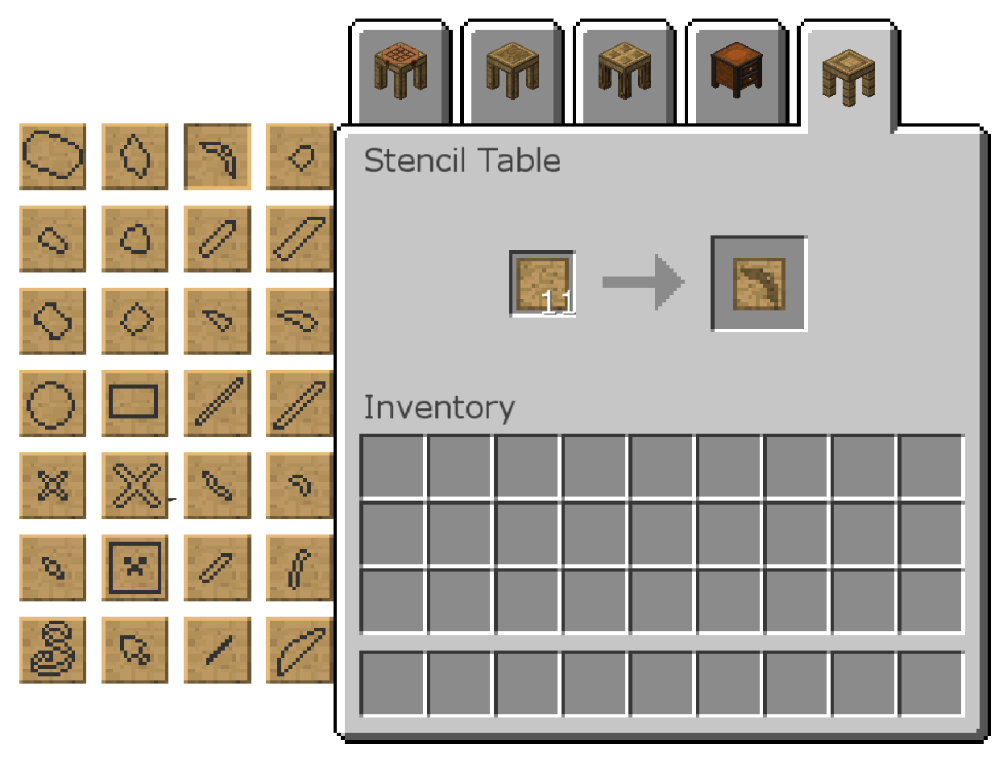

您可以將這些模具儲存在模具箱。

部件加工台是您使用模具和材料以製造工具所需零件的地方。
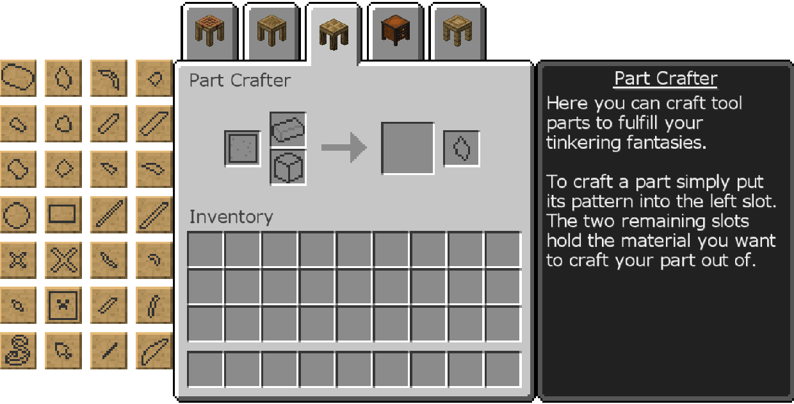
單擊左側的按鈕以選擇模具，然後將一種材料放入其旁邊的一個槽中。右側的信息框將更新以顯示每個零件的該材料統計數據。您可以將鼠標懸停在統計數據上以查看更多信息。
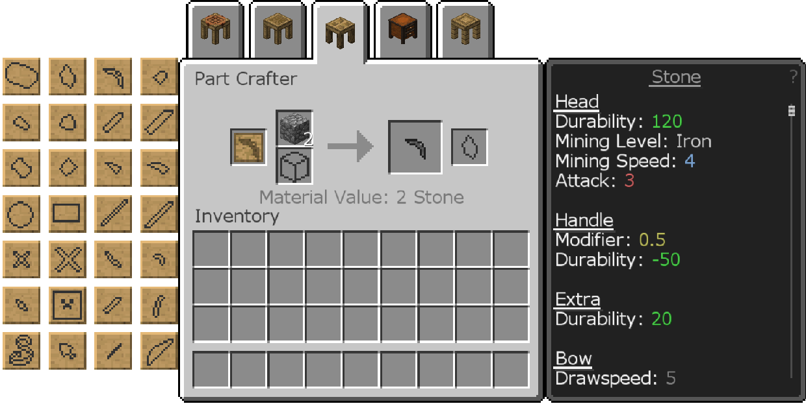
您只能在部件加工台中用非金屬製作零件。金屬需要冶煉爐，稍後會介紹。
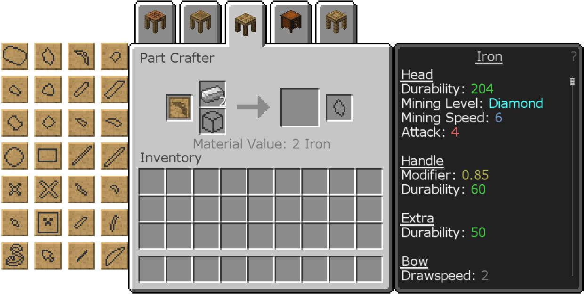
如果部件加工台正在緊鄰模具箱，您可以從中取出模具，而無需打開它。

工具組裝台是您組合零件以製造工具的地方。
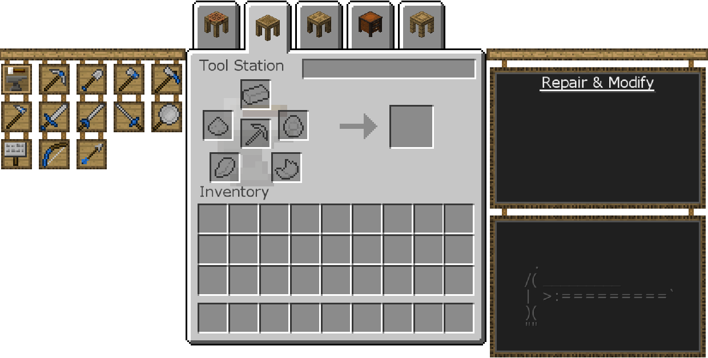
單擊左側要製作的工具，然後將工具零件放入各自的槽中。
右側會根據用於製作它的零件告訴您工具的統計數據和特徵。

下圖中的鎬（由石鎬頭、紙綁定結和海綿手柄製成）可以開採鐵礦石和任何“軟”的東西，如煤礦石和石頭，但不能開採鑽石或紅石等任何東西。
您可以通過在頂部的文字框中輸入來為其命名。
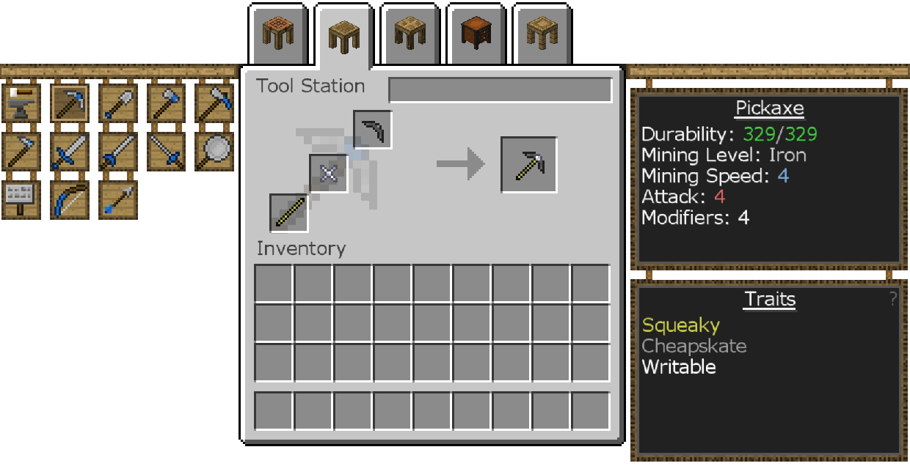
您還可以通過將完成的工具放在第一頁的中間槽並將強化項目放在周圍的槽中來在工具站中添加強化。
有關可用於您的工具強化的信息，請參見材料與您。
工具只能有有限數量的強化。當工具放在裡面時，可以在工具組裝台的右側看到剩餘的數量。
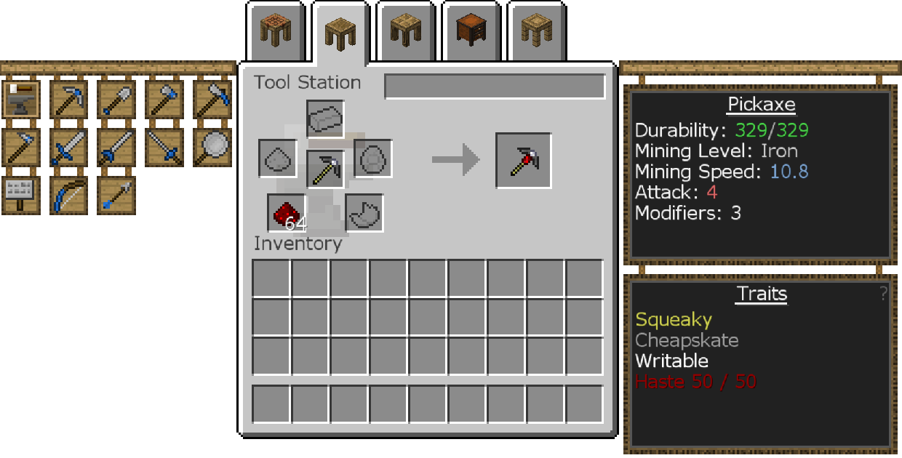

工具組裝台只能製作有限的工具。要製作更多種類的工具，您需要製作和使用工具裝配台，它的工作原理與工具組裝台相同，只是提供了更多可製作的工具。您幾乎可以用任何金屬磚製作工具裝配台，區別僅在於美觀。

將鼠標懸停在物品欄中的工具上會顯示強化和統計數據，以及工具級別。當Tinkers' Tool Leveling 模組安裝後（它已經在這個模組包中），使用工具會給它經驗值。升級工具會給它一個額外的強化空間！
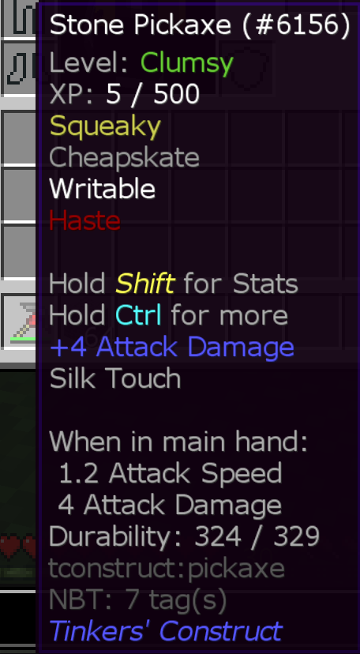

您可以通過將完全修復的工具與要安裝在其上的工具零件組合來更換工具零件。這將替換掉您要替換的工具零件及其提供的任何特徵。
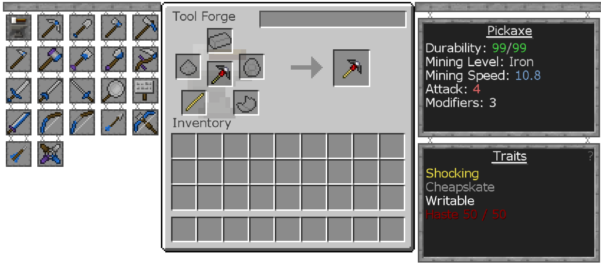

如果您想在不改變其統計數據或特徵的情況下升級工具的挖掘級別，您可以使用磨刀石加上燧石。這只會改變工具的挖掘級別，而不會影響其他一切。這不使用強化空間，可以多次完成。如果磨刀石與工具都由相同的材料製成，您也可以使用它來修復。
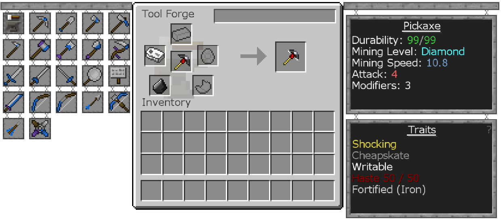

壓印允許您將工具零件的特徵添加到工具中，而無需更換工具零件。因此，如果您真的喜歡某個工具零件的特性但不喜歡統計數據，則可以將該工具部件壓印到工具上，而不是將零件替換到其上！
