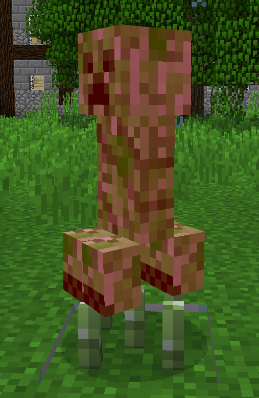
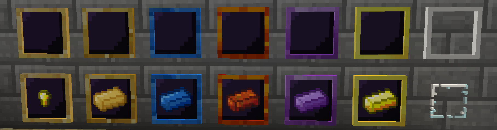
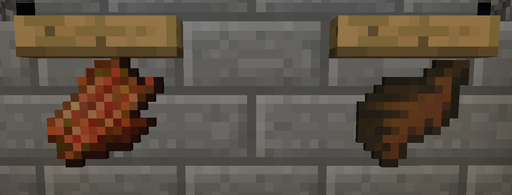
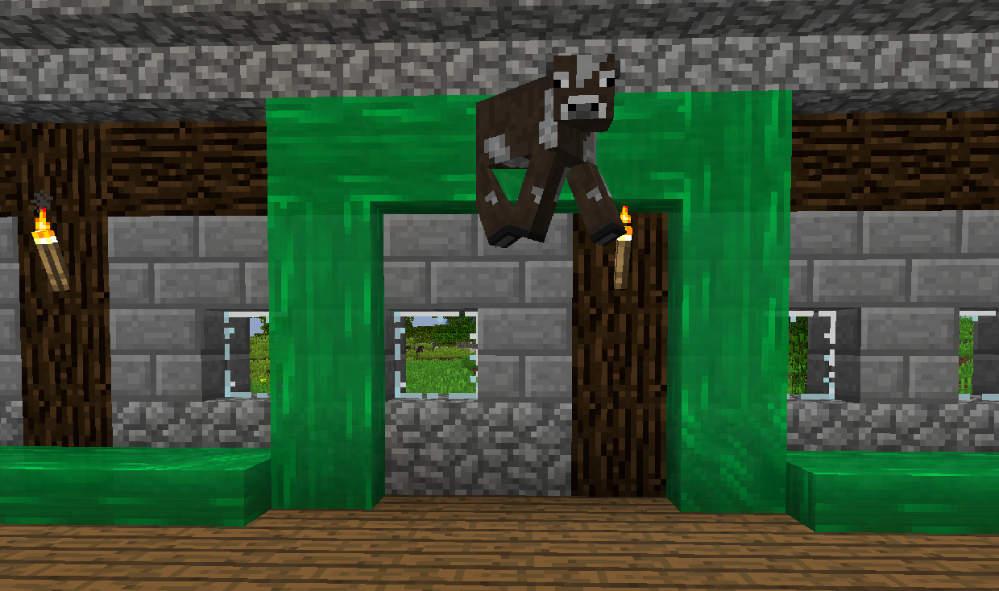
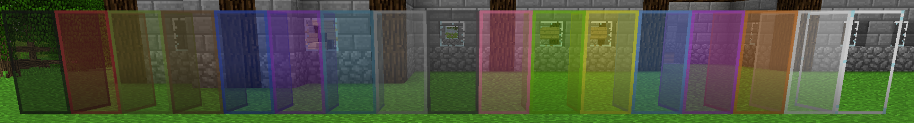
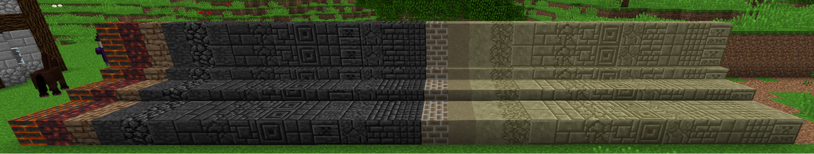

# 其他有趣的東西

匠魂還添加了許多其他與工具或武器無關的有趣內容。

史萊姆靴會讓你在墜落著陸後彈跳，消除所有墜落傷害。你可以潛行讓它不起作用。

按住上右鍵並瞄準一個方塊然後鬆開會讓你朝反方向飛行。強烈建議在使用前穿上史萊姆靴。

石柄火把和石頭梯子的工作原理與普通的火把和梯子類似，讓你只能使用在採礦時找到的東西來製作！

螢光球是一種投擲物，在它掉落的地方放置一個光源。

EFLN 是一種投擲物，它會在掉落的地方爆炸，破壞方塊但不會破壞物品。在你使用這些的地方要非常小心，它們是非常具有破壞性的。

尖竹釘是一個放置型的方塊，會快速傷害接觸它們的生物，並施加緩慢 II。

有一堆新的物品展示框與普通的物品展示框完全一樣，但看起來不錯。

對著生物點右鍵可以把他們背起來放在您的頭上。卸下小豬背包以將生物放下。

使用晾乾架烘乾某些物品，將它們變成其他物品。這主要用於將生食變成肉乾。您也可以將某些熟食烘乾成皮革。

史萊姆通道就像傳送帶一樣工作；它們將物品和生物等實體推向它們流動的方向。這包括向上、向下和沿著牆壁！
史萊姆通道不會阻止生物生成，因此您可以在生物磨床中使用它們在它們生成時推動它們。

通透玻璃顧名思義就是質地更清晰的玻璃。相互接觸的通透玻璃塊將失去連接它們的邊界，因此您可以擁有大玻璃板而不會出現縱橫交錯的白線！

匠魂中有大量裝飾性方塊！在 JEI 中搜索“@Tinkers'Construct”以查看模組添加所有內容的完整列表。
