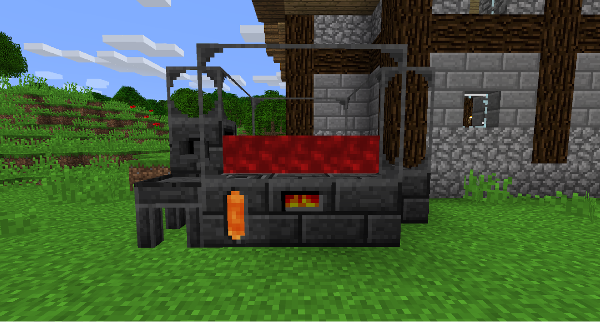
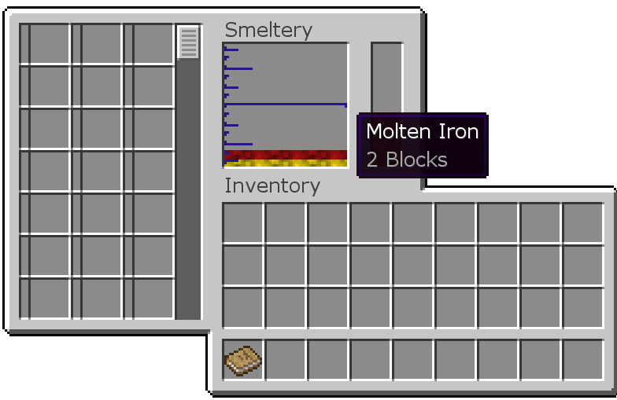

# 冶煉爐

冶煉爐是一個多方塊結構（也就是說，它需要多個方塊以特定模式運行，就像地獄傳送門一樣），用於以熔岩為代價熔化金屬。

要建造冶煉爐，請建造一個所有牆壁和地板都由焦黑石、焦黑石磚、焦黑玻璃或幾乎任何其他焦黑石製成的結構。
其中一個塊必須是冶煉爐控制器，您可以在其中放入物品。
焦黑儲罐裝有岩漿來為冶煉爐提供燃料。

為了插入/提取流體，冶煉廠需要一個帶有澆注口（或任何其他管道）的冶煉爐排液口。
在澆注口下，放置一個澆鑄台（或一個鑄造盆，如果你想製作方塊而不是物品）。
您可以製作任何尺寸的冶煉爐，只要它是矩形的。
冶煉廠內部的方塊越多，可供使用的熔煉槽就越多。

打開冶煉爐控制器，你可以放入金屬。如果它有岩漿，它會開始升溫，然後變成熔融金屬。一個錠通常等於該熔融金屬 144mB。

預設情況下，熔化礦石會給你兩個錠的熔融金屬，有效地使你的礦石翻倍。某些模組包可能禁用了此功能。

熔融金屬的某些組合會產生合金。如果冶煉爐中的兩種熔融金屬可以合金化在一起，它們就會合金化，所以要小心同時將哪些金屬放入冶煉爐。

新熔化的金屬將進入堆疊的頂部，底部的東西會先被鑄造。您可以單擊熔化的金屬將其發送到底部，以便您可以鑄造它。

要製作鑄件，請用您不介意丟失的廉價材料製作工具零件並將其放在澆鑄台中。熔化 2 塊金錠或 1 塊鋁黃銅錠，然後啟動澆注口將熔化的金屬倒在工具部件上。這將為金屬零件創建可重複使用的鑄件模具，從而破壞您在此過程中使用的工具零件。

您可以用 2 個粘土做同樣的事情來製作黏土鑄模，使用一次後會損壞，但要便宜得多。

要製作金屬工具零件，將鑄件放入澆鑄台並啟動澆注口，熔融金屬將倒入鑄件模具並硬化。再次右鍵單擊澆鑄台以取出金屬工具零件。

