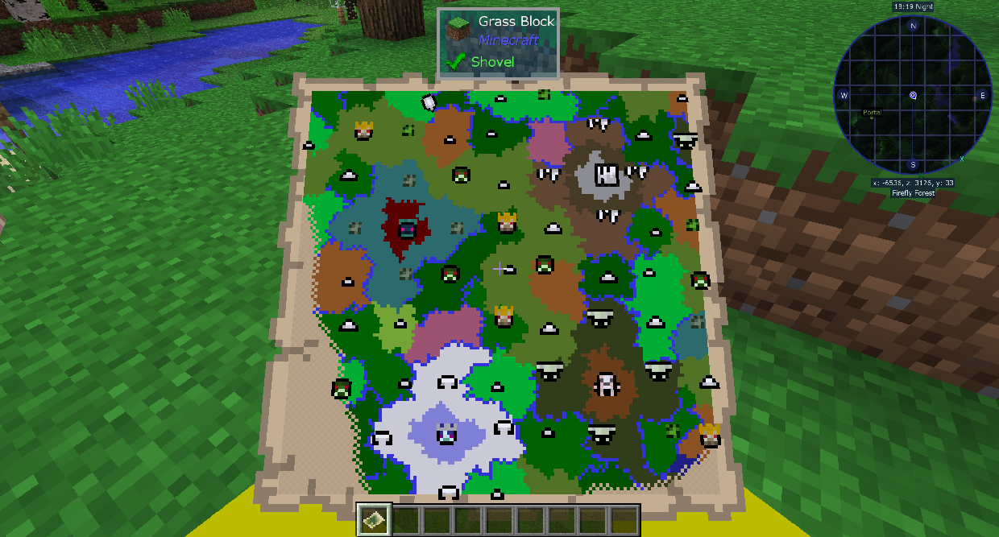

# Bosses

暮光森林的進展與boss有關。每個 Boss 都會在自己的生物群系和自己的結構中生成，如果不擊敗前一個 Boss，您將無法進入。

探索暮光森林的最佳方式是使用魔法地圖。製作一張空白魔法地圖並右鍵單擊它以將其打開。它將根據生物群系著色，並在建築物所在的位置帶有圖標。您可以使用這些來找到Boss。

你必須先按順序擊敗森林Boss，然後你可以按任意順序進入沼澤、冰雪或黑暗森林生物群系（儘管每個都有自己的進度）。