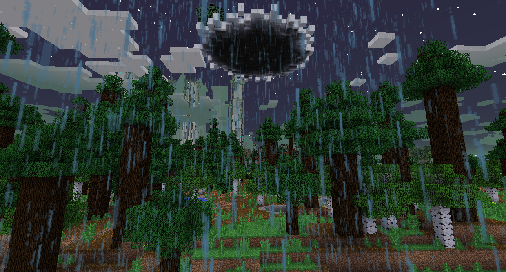
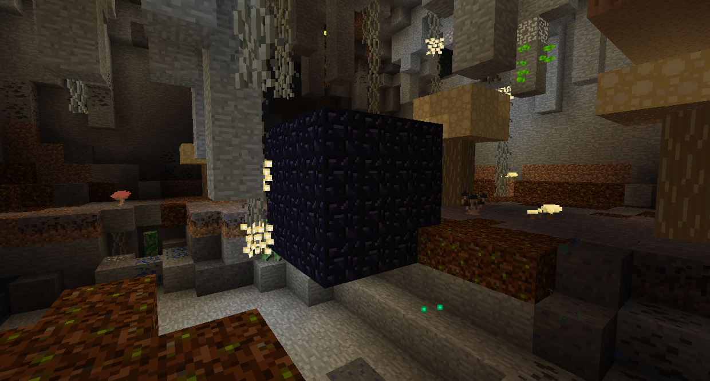
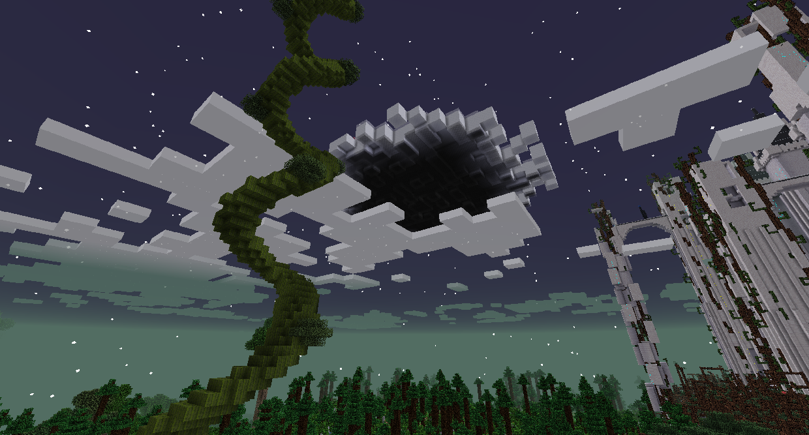
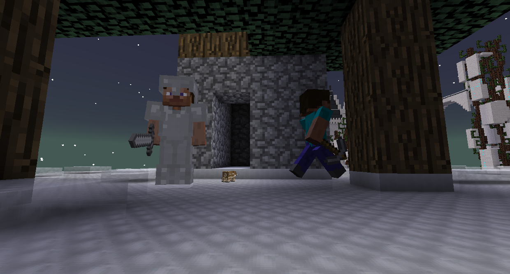
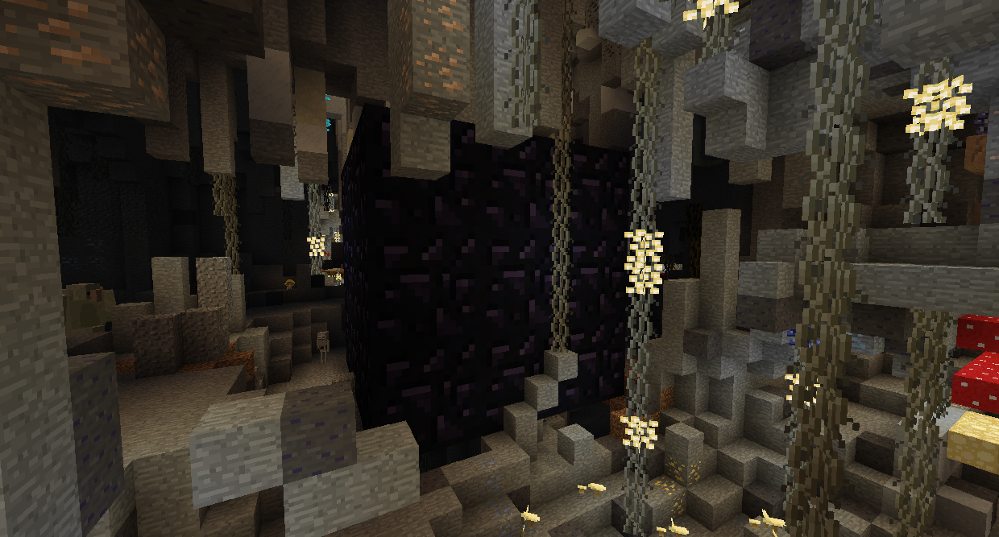

# 高原Bosses

如果您還沒有擊敗暮光幽靈、九頭蛇和冰雪女王，高原將傾盆大雨，造成嚴重破壞。

首先，你會想從地下進入巨魔洞穴。顧名思義，它將充滿巨魔。殺死洞穴巨魔會點亮附近的巨魔藤蔓，提供自然光源。
你想要找到的是一個小的黑曜石房間。挖掘它並從裡面取回培養土和魔豆。

回到地面，從上面的雲走到外面。放置一些培養土並種植一個魔豆。爬上豆莖到雲中小屋。

擊敗礦工巨人獲得巨人之鎬，它可以開採巨大的方塊。返回巨魔洞穴並使用巨人之鎬挖掘巨型黑曜石房間並獲取灰燼神燈。

灰燼神燈可以讓你進入荊棘之地。右鍵點擊荊棘來燃燒它們，讓你穿過它們。如果你還沒有拿到灰燼神燈，荊棘之地就會下酸雨。

一旦你到達城堡，你就基本完成了。暮光森林尚未完成，目前還沒有最終 Boss。如果你願意，你可以接管城堡並住在裡面，但這裡沒有什麼可做的。