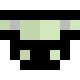
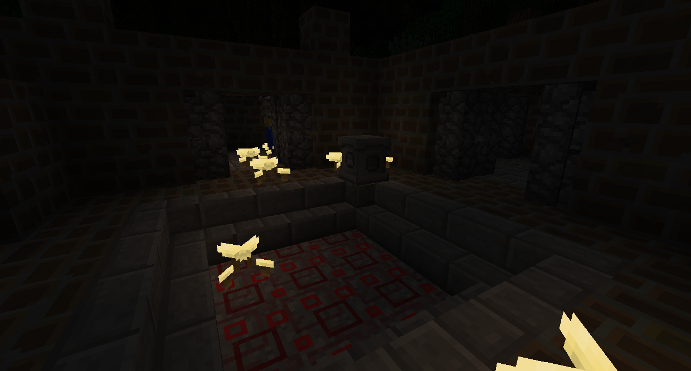
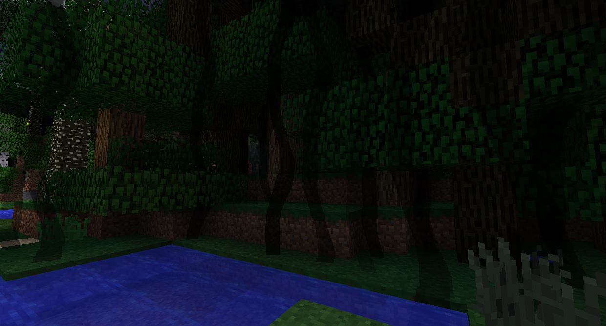
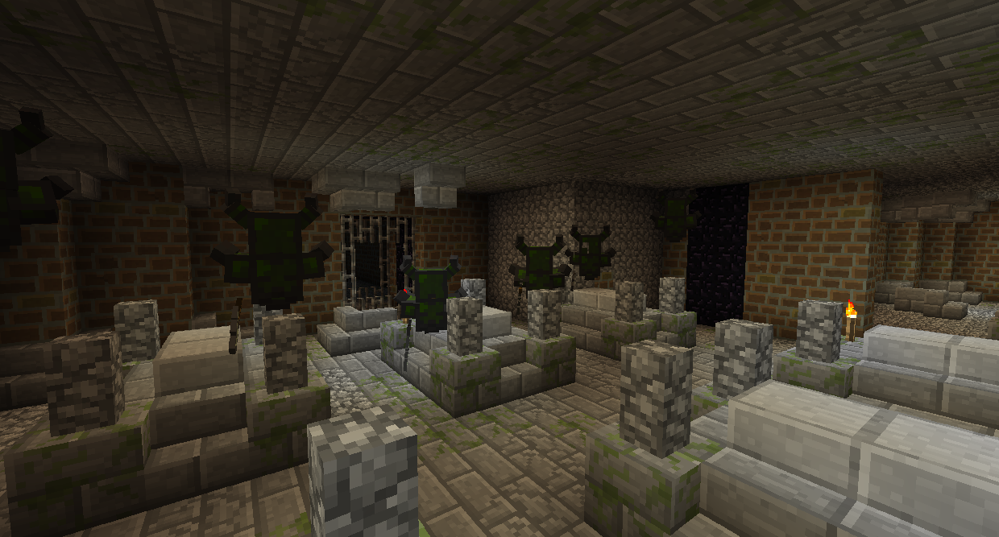
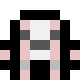
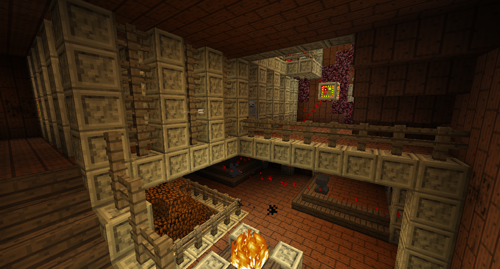
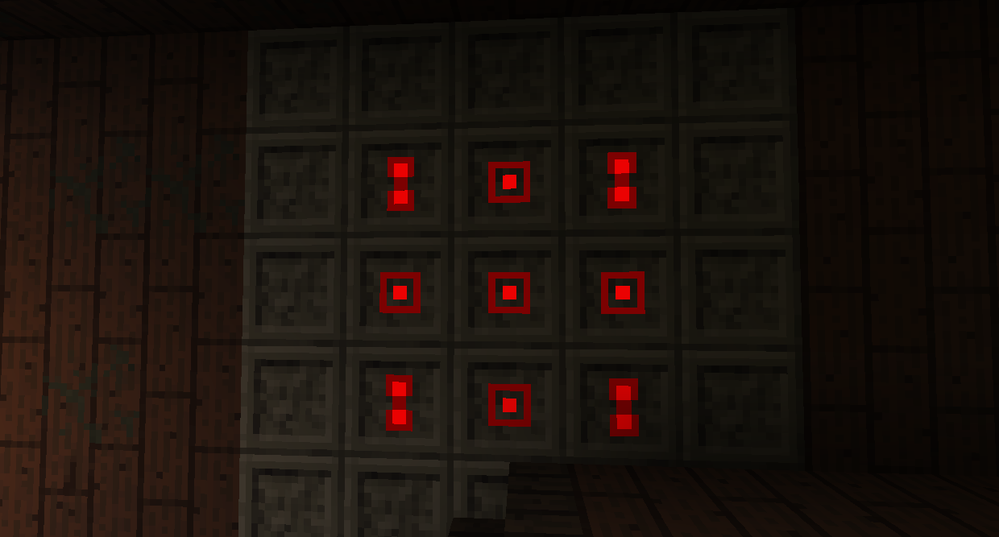
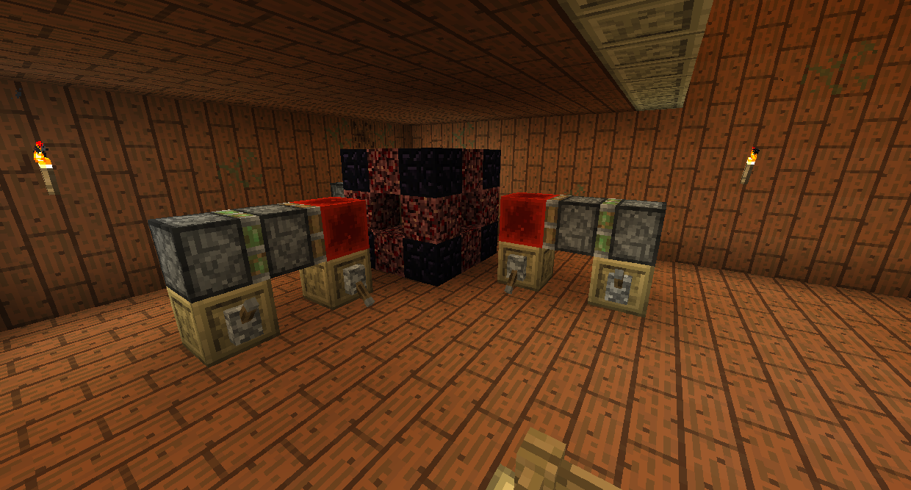
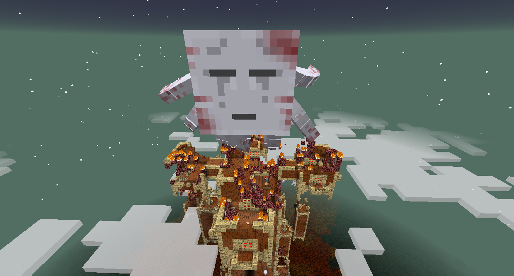

# 黑暗森林Bosses

### 幻影騎士

幻影騎士是裝甲幽靈，可以在哥布林堡壘的底部找到，在黑暗森林中生成。您必須將任何戰利品放在戰利品座上才能進入要塞。

如果你沒有殺死和掠奪巫妖王，黑暗森林會有黑暗的捲須，可以讓你失明。

哥布林堡壘佔地廣闊，到處都是戰利品和敵人。你最終會找到一個有六個幻影騎士的地穴。它們無法免疫任何傷害，因此您可以隨心所欲地殺死它們。
一旦他們都死了，房間中間會出現一個戰利品箱。擊敗幻影騎士還可以讓您進入黑暗森林中心的黑暗之塔。

### 暮光幽靈

暮光幽靈是一個巨大的惡魂，位於黑暗之塔的頂部。

如果你沒有殺死幻影騎士，黑暗森林中心就會有一場無法逾越的暴風雪，給人一種極度緩慢的感覺。

黑暗之塔充滿了敵人和謎題。一旦右鍵單擊，重新出現的方塊將消失幾秒鐘，讓您可以穿過它們。

一些謎題可能涉及反建造，它們不允許您在其區域放置或破壞方塊。破碎的方塊會很快重新出現，但你有一個小窗口可以穿過。前往 Anti-Builder 並打破它以完成這個謎題。

你最終會到達一扇鎖著的門。要通過它，請穿過其他相連的路徑並找到 4 把黑暗之塔鑰匙。您可能無法到達某些區域，因此您必須建造一條道路。

翻轉拉桿以獲得有趣的驚喜！

在黑暗之塔的最頂端，你會發現暮光幽靈。它具有三種攻擊方式：它可以發射火球，下熾熱之淚雨，和召喚幽靈。幽靈會在幽靈陷阱周圍生成，在陷阱附近殺死它們，然後從附近的壓力板給它一個紅石信號，如果它在陷阱上方，就會困住暮光幽靈，造成嚴重傷害。使用遠距離武器殺死暮光幽靈。
殺死暮光幽靈會在競技場中央生成一個戰利品箱。它將包含一個暮光幽靈戰利品、砷鉛鐵結晶和熾熱之淚，這是進入高原的要求之一。