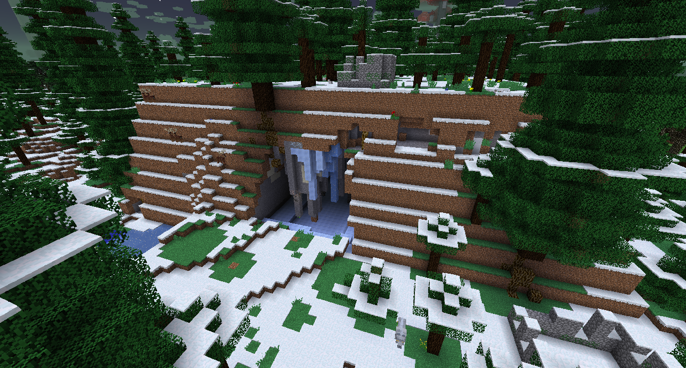
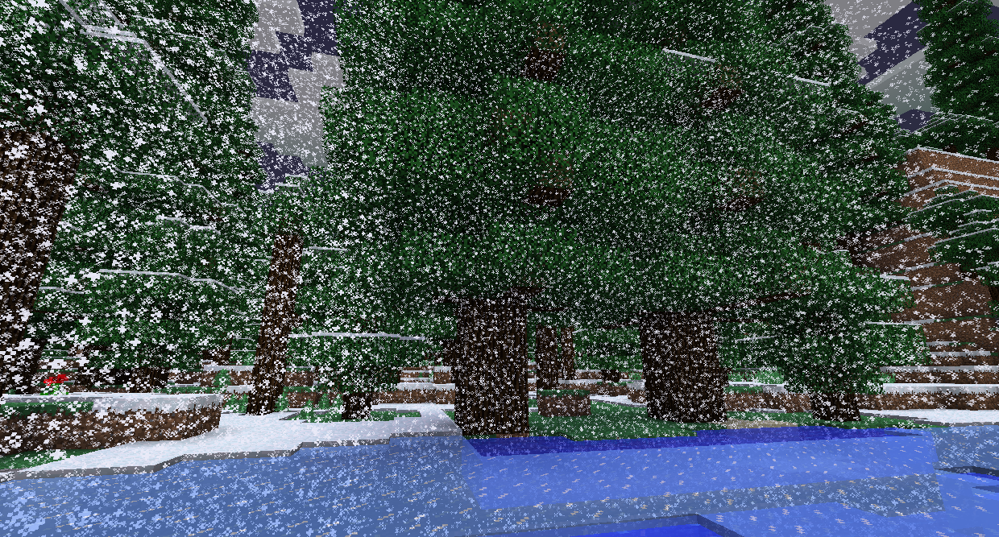
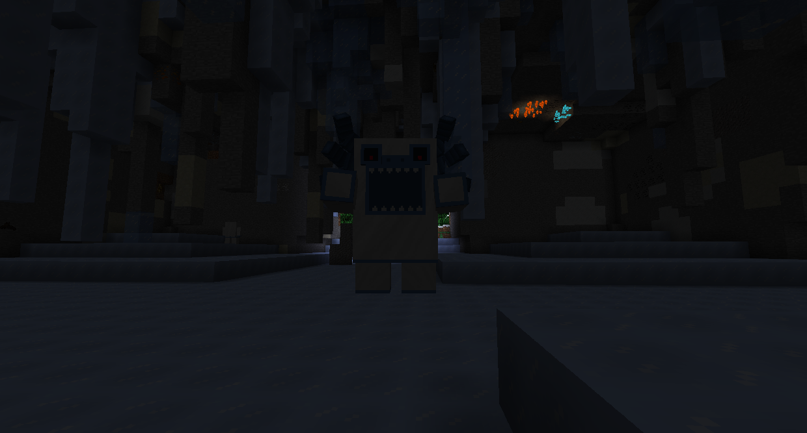
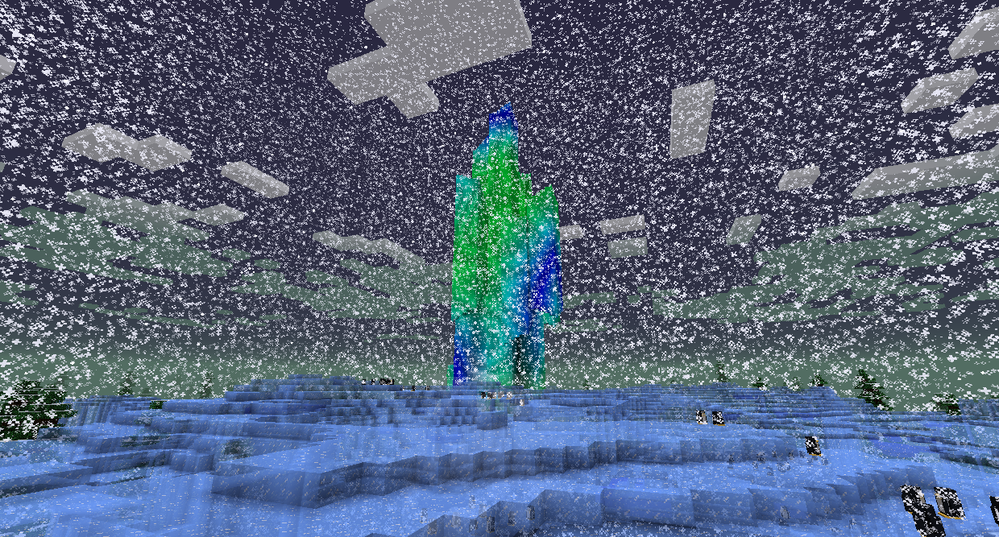
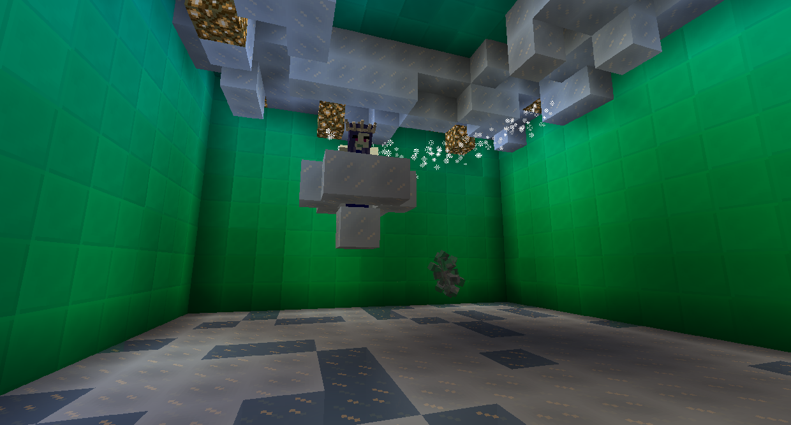

# 冰原Bosses

### 雪怪首領

雪怪首領是一種巨大而毛茸茸的怪物，可以在雪怪洞窟中找到，它在雪地中生成。

如果你還沒有殺死和掠奪巫妖王，雪地森林將會有一場無法逾越的暴風雪，帶來極度的緩慢。

您可以在雪怪洞窟的中心找到雪怪首領。雪怪首領會首先向玩家扔大塊冰塊，凍結它靠近的所有東西。在此階段，它將阻止所有遠程命中。如果玩家被近距離擊中，它將進入下一階段，上下跳躍使冰從天花板上掉下來。20 秒後，它將返回到第一階段。

雪怪首領被擊敗後，它會掉落冰霜炸彈（可以讓你像雪怪首領一樣投擲）、極地毛皮和雪怪首領毛皮，這是攀登冰川所必需的。

### 冰雪女王

冰雪女王在冰川的極光宮殿裡的頂端。

如果你還沒有殺死和掠奪雪怪首領，冰川將會有一場無法逾越的暴風雪，導致極度緩慢。

極光宮殿有各種以冰為主題的敵人要打敗。冰雪女王在頂部。她騎著一團飛行的冰雲，阻止傷害通過。
冰雪女王可以生成冰晶，砸在地上，並沿著地面滑行射擊冰魔法。 使用最後兩個動作作為造成傷害的機會。

擊敗冰雪女王將獲得三矢弓（射出 3 支箭）或追蹤弓（其箭矢瞄準敵人），以及冰雪女王戰利品。打敗冰雪女王也是進入高原的條件之一。