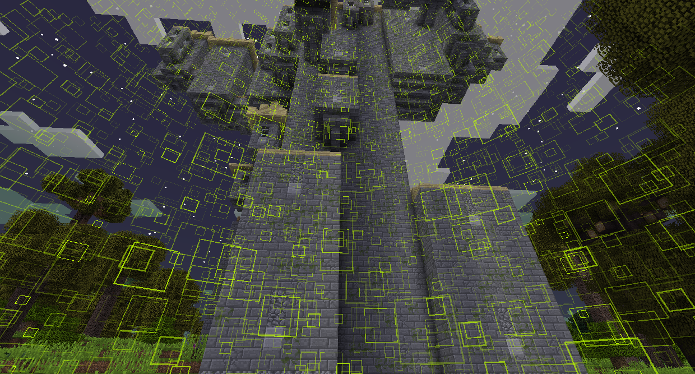
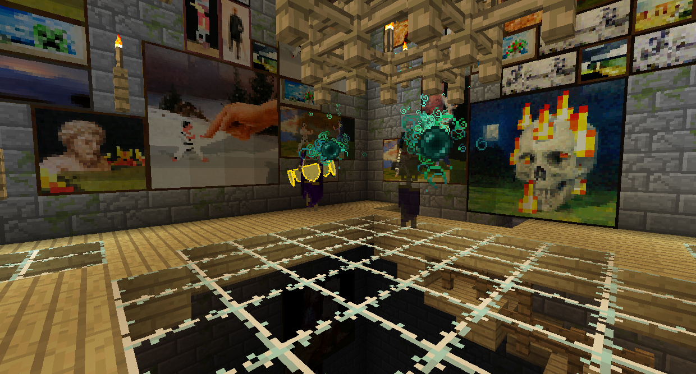

# 森林Bosses

### 納迦

納迦是一種巨蛇，可以在納迦庭院中找到，它生成在大多數森林生物群系中。
它會追著你跑，撞擊你造成傷害。你可以通過擊打任何地方它來傷害它。當它失去生命時，它會變短。不需要特別的策略，打到死就行了。

納迦會掉落納迦鱗片和納迦納迦戰利品。撿起這些可以讓你進入巫妖塔。

### 巫妖王

巫妖王是一個骷髏王，可以在巫妖塔中找到，巫妖塔生成於大多數森林生物群系。

如果你沒有殺死和掠奪納迦，巫妖塔將受到魔法的保護。生物將無法受到傷害，並且方塊將無法被破壞。

你可以在塔頂找到巫妖王。

巫妖王之戰分為三個階段：
在第一階段，巫妖會抵抗所有傷害並有 2 個巫妖王的僕從攻擊你。藍色的魔法球可以被反彈以打破它的護盾，橙色火球則會爆炸。
一旦它的所有護盾都被擊落，巫妖王就會開始召喚殭屍僕從來攻擊你。
殺死所有殭屍僕從，巫妖王將開始用金劍直接攻擊你。它現在可以受到你的傷害。

殺死並掠奪Swamp后，您將能夠進入沼澤、黑暗森林和雪地生物群系。

被擊敗後，巫妖王會掉落 4 個權杖中的其中一個。

黃昏權杖將允許您發射與巫妖王在第一階段使用的相同的藍色魔法球。每個魔法球造成 3 顆心的傷害。權杖可以使用 99 次，然後需要用終界珍珠充電。

吸血權杖會吸取任何目標生物的生命值，並將該生命值提供給使用它的玩家。它可以使用 99 次，然後需要用發酵蜘蛛眼充電。

殭屍權杖會生成一個殭屍僕從，類似於巫妖王生成的殭屍。一段時間後，殭屍僕從將開始燃燒直至死亡。在需要用腐肉和力量藥水 II 充電之前，它可以使用 9 次。

護盾權杖會在玩家周圍召喚盾牌。這些護盾會阻擋所有物理傷害，但之後會破裂。它可以使用 9 次，然後需要用金蘋果充電。