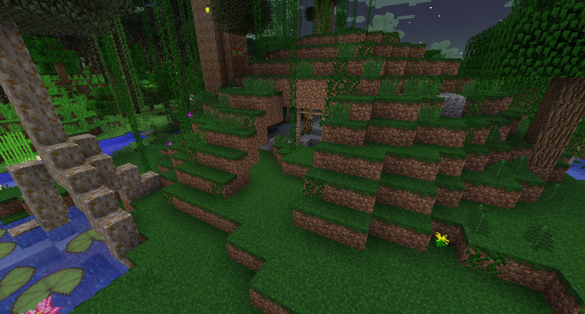

# 沼澤Bosses

### 牛頭人迷宮

米諾菇是一種牛頭怪，可以在迷宮的底部找到，在沼澤中生成。

如果你沒有殺死和掠奪巫妖王，暮光森林將充滿蚊子，它們會攻擊你並給你帶來飢餓。

在迷宮內，您可以找到米諾陶戰士、迷宮史萊姆以及噴火甲蟲與黏液甲蟲。米諾陶戰士有機會掉落迷宮地圖核心，可以將其製作成迷宮地圖，從而使迷宮導航變得更加容易。他們還可以製作暮光工作台，讓您可以將物品重新製作成其基本成分。
迷宮是由迷宮石製成的，很難挖掘。還有陷阱和大量戰利品，所以一定要抓住你能攜帶的東西。

在迷宮的底部，您可以找到米諾菇。它有大量的生命值並造成相當大的傷害，所以要做好戰鬥的準備。沒有涉及任何特殊策略，只需持續攻擊即可。

殺死米諾菇將為您帶來米諾菇戰利品和一些牛頭人醬肉，以及寶箱中的寶藏。吃掉牛頭人醬肉就可以進入沼澤中心的火焰沼澤。

### 九頭蛇

九頭蛇是一條巨大的多頭龍，會噴火並生成在火焰沼澤中心的九頭蛇巢穴中。

如果您還沒有吃過牛頭人醬肉，那麼火焰沼澤會太熱而無法進入，如果您嘗試，它會點燃您。

九頭蛇會通過向您噴火或發射爆炸性炸彈來進行攻擊。它只能通過張開的嘴被射擊而受到傷害，所以試著引誘它向你噴火。

一旦被擊敗，九頭蛇將掉落九頭蛇肉排、九頭蛇戰利品和熾熱之血，這是進入高原所需的一件事。