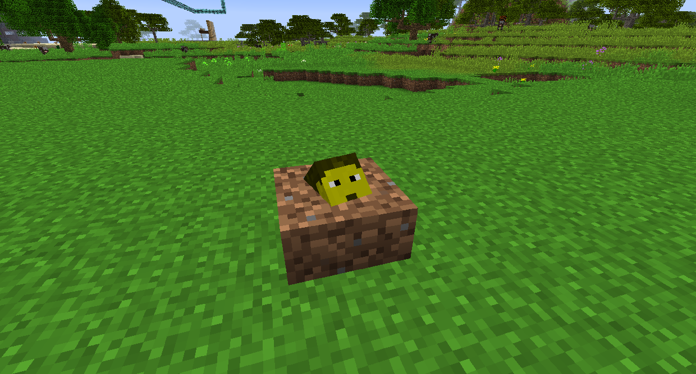
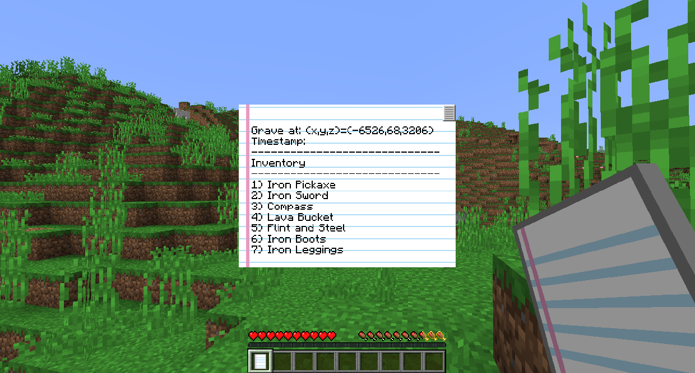
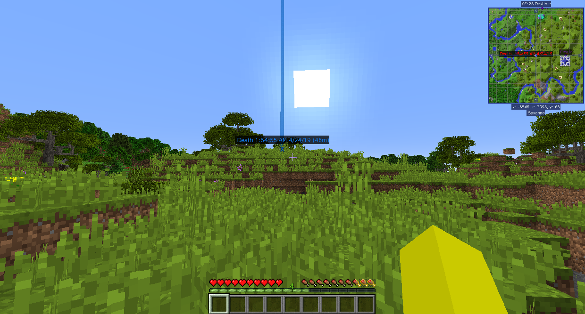

# 墓碑

Tomb Many Graves 模組使得當你死亡時，一個玩家墳墓被放置在你死亡的位置的世界中。您可以返回它並站在它上面潛行，以將您物品欄中的所有物品歸還到原來的位置。

當你重生時，你會有一個死亡物品清單，上面會告訴你你死時物品欄中的所有東西，以及你的墳墓碑在哪裡。當你靠近時，拿著死亡清單會指向你墳墓的方向。

Journeymap 在您死亡的位置創建一個死亡傳送點，因此您可以輕鬆找到它。您可以在小地圖和世界地圖中看到它，並且看起來像世界上的普通傳送點。