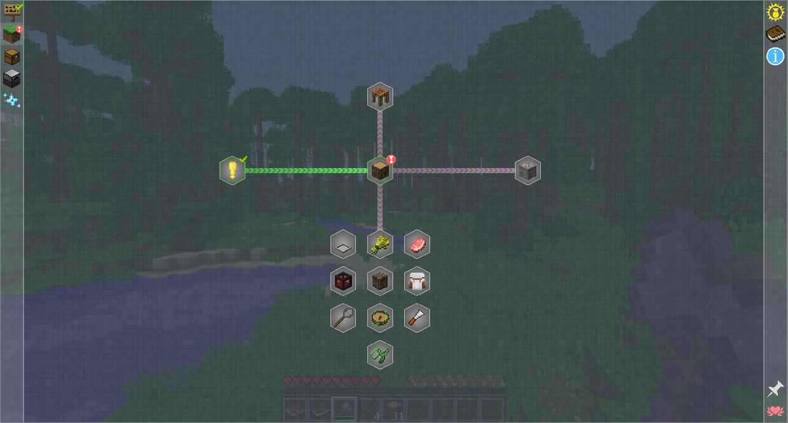
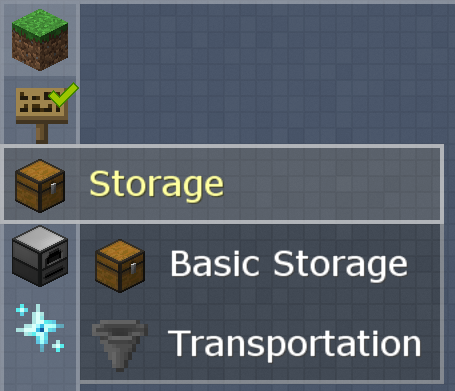
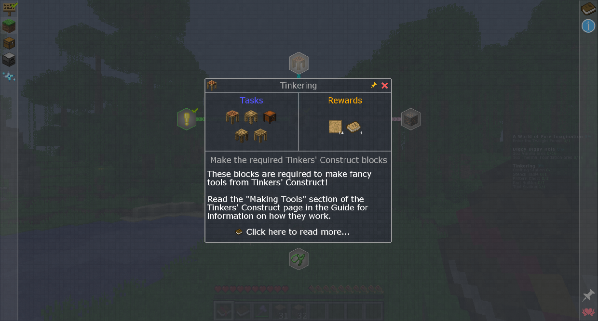
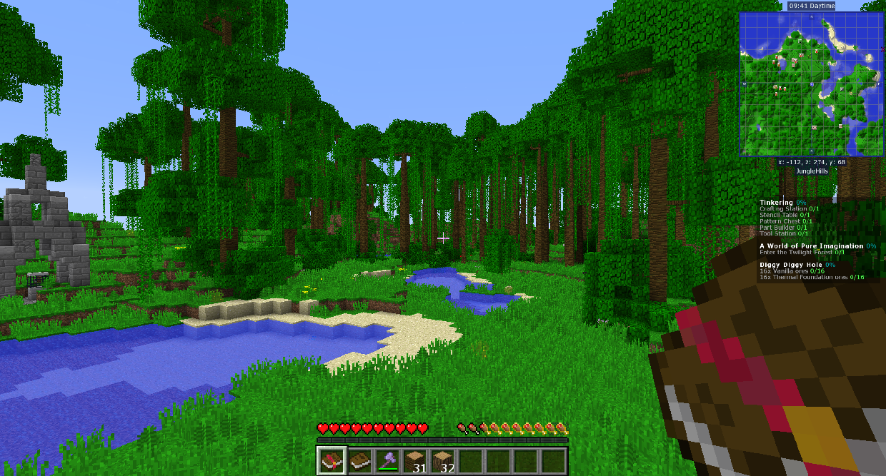

# 任務
## 就像指南，但閱讀量較少

通過單擊物品欄中的此按鈕打開任務菜單：

淺灰色任務可以完成，藍色任務為部分完成，綠色任務為已完成，深灰色任務被鎖定無法完成。

有些任務在完成所有必需的任務後才能看到，而有些任務可以看到但沒有完成。

單擊一個任務將其打開。在那裡你可以看到它的任務和獎勵。
當您擁有所需數量的項目時，項目任務將自動完成。

如果多人在使用 FTB Utilities 的同一團隊中，他們會共享任務進度。

任務分為章節和子章節，它們列在螢幕左側。將鼠標懸停在圖標上可顯示其名稱及其擁有的任何子章節。

您可以通過單擊固定按鈕來固定任務，這將使其在玩遊戲時保留在屏幕上。
您還可以單擊右下角的“固定”按鈕來自動固定所有已解鎖的任務。
