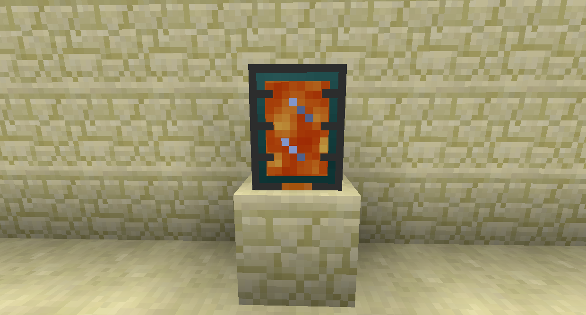
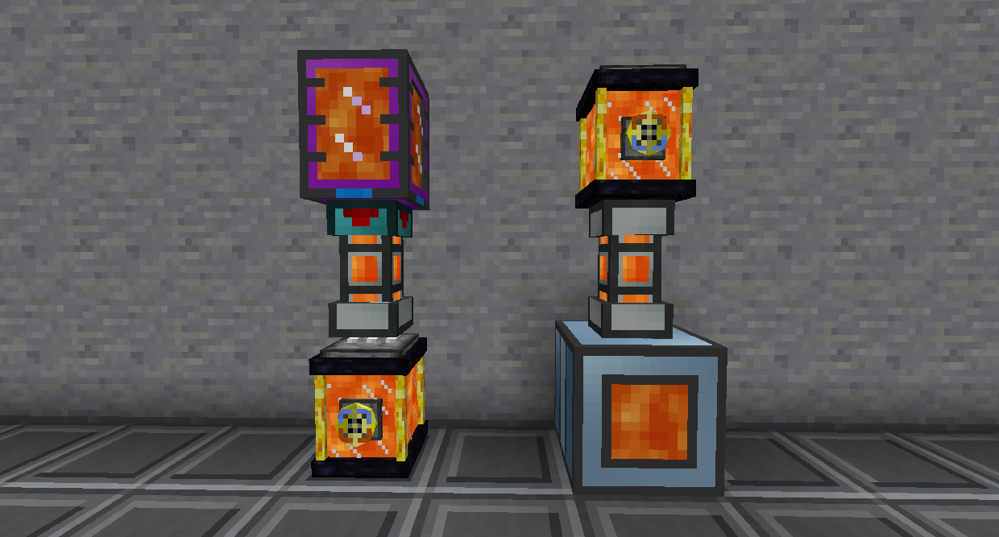

# 流體儲存

便攜式儲罐可儲存液體，即使損壞也是如此。在其上使用新月錘來切換自動輸出。當它處於自動輸出模式時，它會自動嘗試將流體推入其正下方的任何容器，如管道或機器。您可以潛行右鍵單擊便攜式儲罐以新月錘以立即取下。

便攜式儲罐 (基本) 可存放 20 桶，並且可以使用升級套件進行升級以容納更多桶。您還可以使用 保存 對它們進行附魔，以增加它們可以存儲的數量。

相同顏色組合的終界蓄水槽共享內容物。您可以通過單擊頂部帶有染料的白色部分來更改顏色組合。流體可以插入輸入一個，也可以從另一個中取出。

如果它自動輸出到底部流體容器，您可以單擊撥盤進行切換。

您可以使用撥盤上的鑽石將其設為私密。私人終界蓄水槽只會連接到同一玩家放置的相同顏色組合。

黑洞儲液罐可以存儲多達 2,147,483,647mB 的單一流體。
