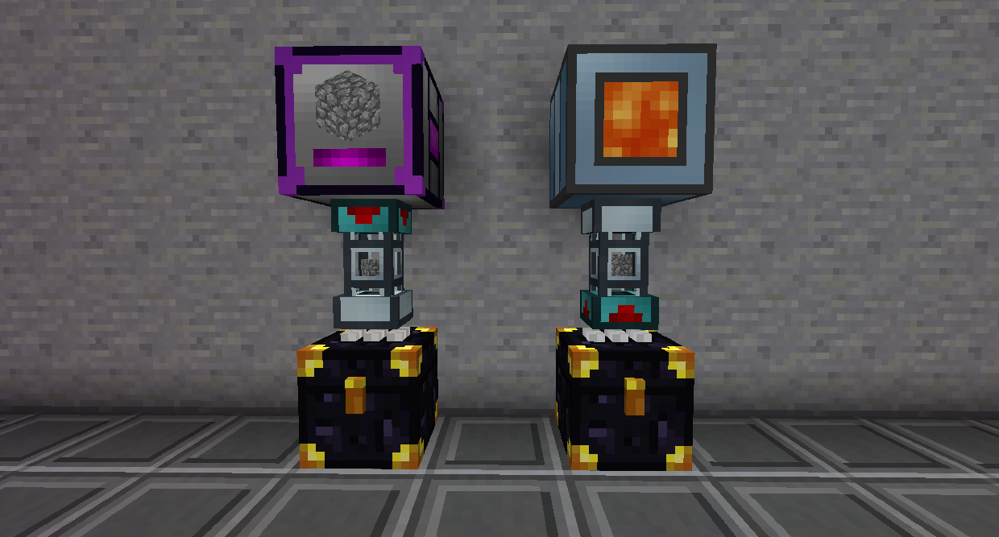
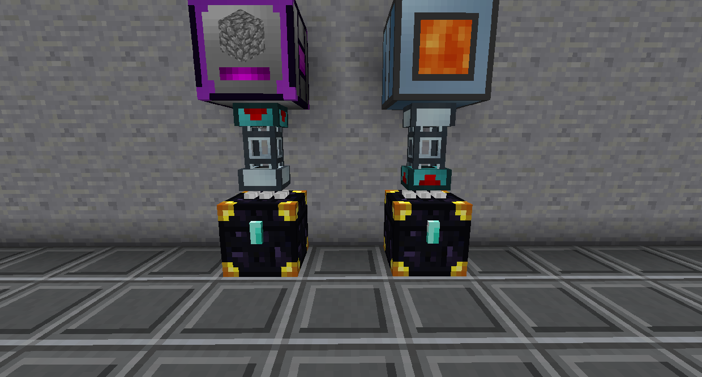
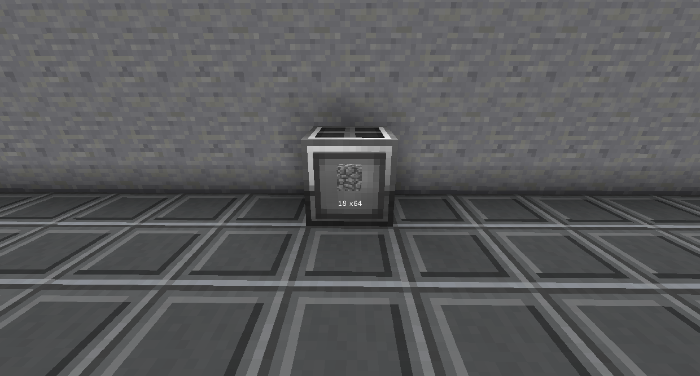
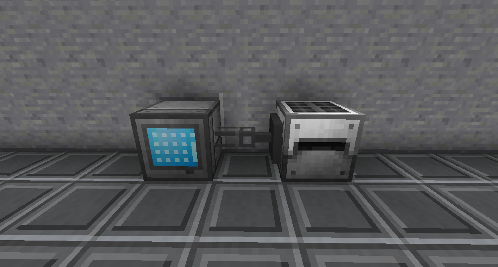

# 其他模組

簡易背包是增加了 4 層的物品欄。您可以設置一個鍵綁定以從您的物品欄的任何位置打開它，包括配件裝備欄插槽。

您可以設置另一個按鍵綁定，以便在拿起特定物品時，它們會自動插入背包。潛行右鍵單擊背包以設置其白名單/黑名單。

小型板條箱有 9*13 個可用槽。中型板條箱有 2 頁，大型板條箱有 3 頁。單擊板條箱兩側的箭頭可在頁面之間移動。

如果您的板條箱中有板條箱守護徽章，它會在損壞時保留其內容物。板條箱守護徽章在這樣做時就會被摧毀了。

相同顏色組合的終界箱共享庫存。您可以通過單擊頂部帶有染料的白色部分來更改顏色組合。物品可以插入一個，也可以從另一個中取出。

您可以在終界箱的閂鎖上使用鑽石將其設置為私有。私人終界箱只會連接到同一玩家放置的相同顏色組合的其他私人終界箱。

終界袋可以通過潛行右鍵點擊它綁定到末影箱。當終界箱被打開時，它會打開被綁定的終界箱的庫存。

保險箱有多個層級，更高的層級可以儲存更多的物品。使用升級或轉換套件升級層級。您還可以使用 保存 對其進行附魔以增加其存儲空間。第一層有 18 個插槽，最高層有 90 個。
物品損壞後仍留在保險箱中。你可以通過潛行右鍵點擊它的新月錘來立即取下它。

背包有多個層級，更高的層級可以存放更多的物品。通過製作升級（在物品上點擊 U 以查看其配方）。您還可以使用 保存 對其進行附魔以增加其存儲空間。第一層有 9 個插槽，最高層有 45 個。
您可以潛行右鍵單擊背包以打開過濾器。如果啟用自動收集，項目將根據過濾器進入 背包而不是您的物品欄。將鼠標懸停在物品欄中的背包上並按住 Shift 以查看鍵綁定以啟用自動收集。

背包（虛空）的工作方式與背包類似，不同之處在於它會立即刪除任何進入它的物品。如果您將其設置為自動收集和銷毀圓石或其他垃圾塊，這將很有用。

黑洞儲存單元最多可以存儲 2,147,483,647 個單個項目。

黑洞標籤可以放置在黑洞儲存單元，使其具有儲物抽屜的功能。左鍵單擊它提取項目，右鍵單擊插入。

黑洞控制器 2.0 最多可以存儲 12 個黑洞單元/除液罐，它們可以通過管道或其他自動化進行互動，就好像它們被放置在世界上一樣。