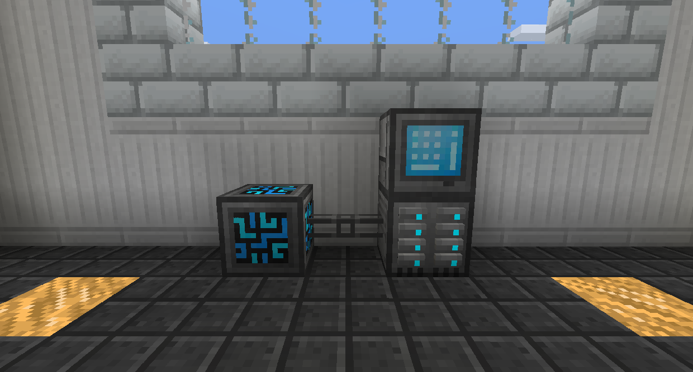
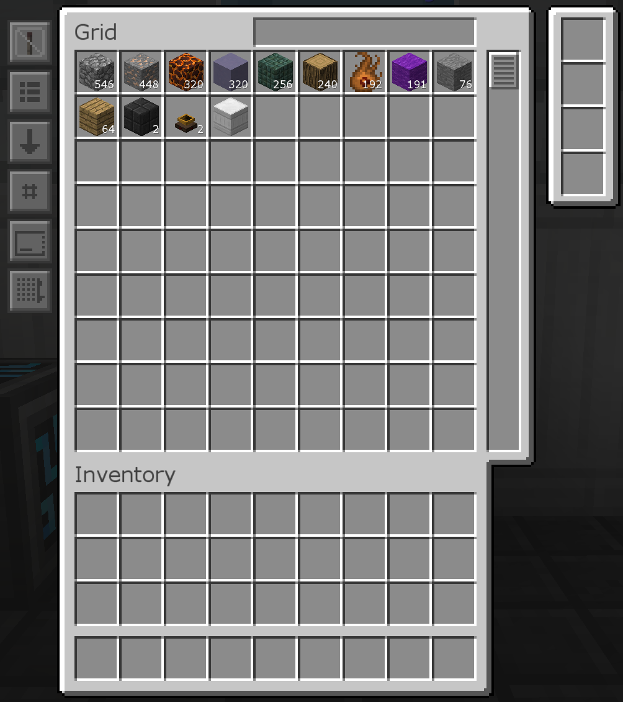
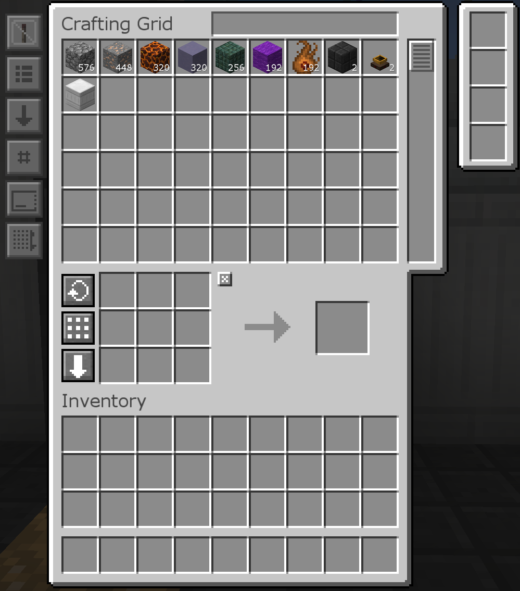
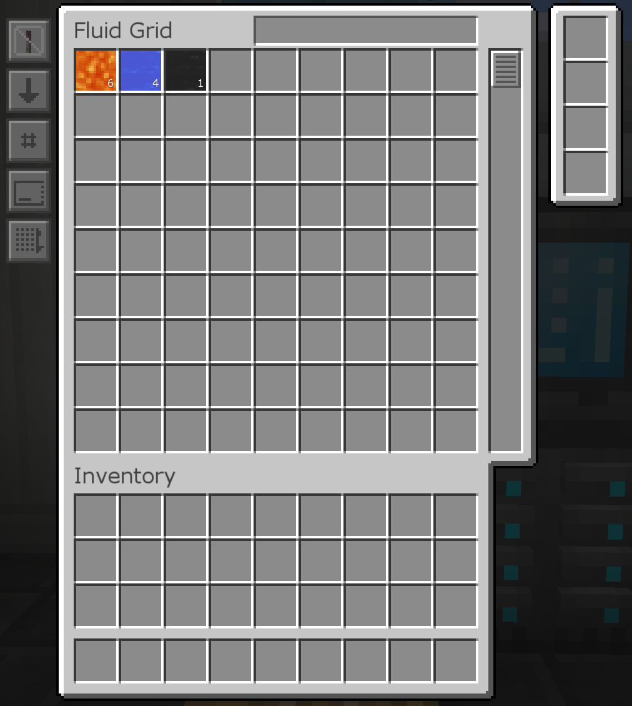

# 精緻儲存-Refined Storage

精緻儲存是一種可讓您以數字方式儲存大量物品的模組。這意味著您不使用箱子和抽屜，而是使用硬碟和面板。

首先，您必須將系統中樞放置在世界中。系統的所有其他部分都必須使用纜線連接到系統中樞。系統中樞也是提供為系統供電的的地方。

將硬碟櫃連接到系統中樞並在其中放置一些硬碟。一個硬碟櫃中最多可以有 10 個任何類型的硬碟。
硬碟將項目儲存為電腦中的文件。儲存空間更大的硬碟可以儲存更多。一個 1k 的儲存磁盤可以儲存 1,000 個項目，4k 可以儲存 4,000 個，依此類推。

面板允許您訪問硬碟中的項目。物品堆疊沒有限制，所以如果你有超過 64 個物品，它會留在一個插槽中。
您可以在頂部的文字框中搜索項目。

合成面板內置了一個 3x3 的工作台，可以使用儲存在系統中的物品。

您可以像任何其他物品一樣將盛有流體的桶放入流體面板，從而將流體移入和移出流體網格，這將清空桶。要取出流體，請單擊流體，它會嘗試從您的物品欄或儲存網絡中填充一個桶。
流體儲存磁盤儲存流體而不是物品。一個 64k 的流體儲存硬碟可以儲存 64,000mB（64桶）的流體。