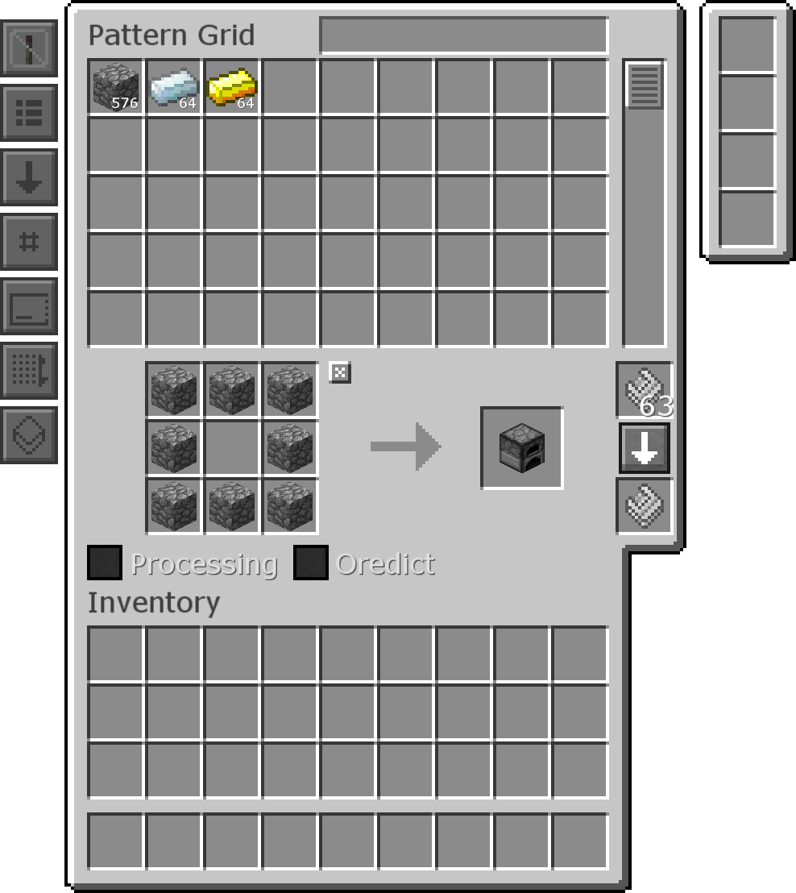
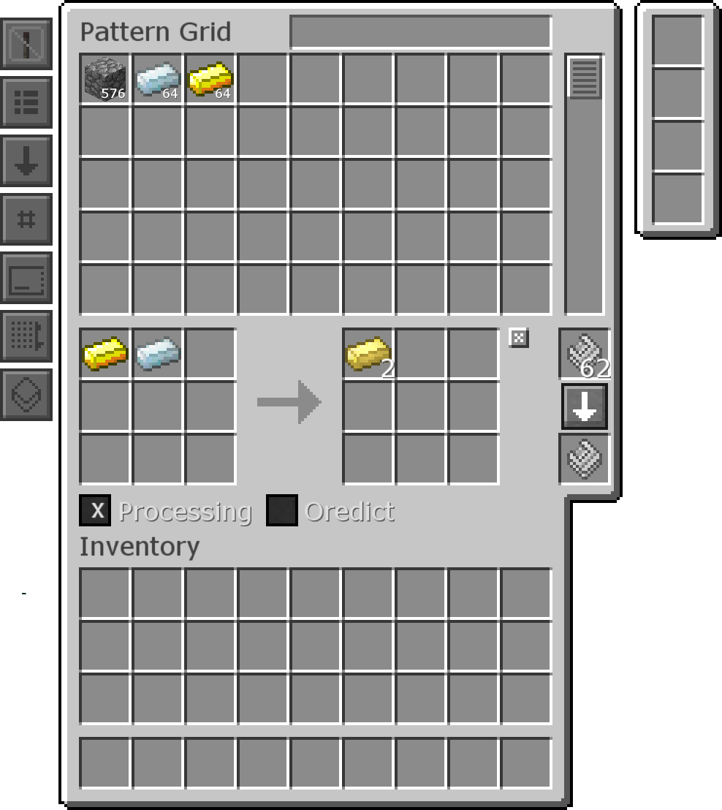
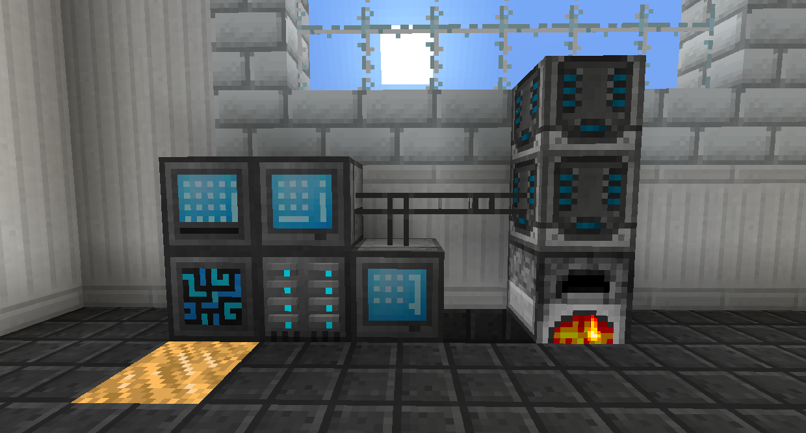

# 自動合成

自動合成允許您自動製作物品。不必手動將配方放入製作網格，您只需單擊該項目並告訴它您想要製作多少。

如果您要製作的配方在常規 3x3 製作中，只需將配方放入模板面板，然後單擊右側的箭頭將其分配給該模板。
您必須在右側的頂部插槽中放置模板。

如果您想要製作的配方需要不同的機器，例如熔爐或其他任何無法在一般工作台上完成的東西，請勾選處理框。將成分及其數量放在左側的框中，然後將結果及其數量放在右側的框中。

如果您希望配方使用礦物詞典，例如能夠使用任何 *ingotCopper*製作銅齒輪，請勾選 使用礦物字典框。如果您希望它僅使用您放入的特定物品，例如如果您想確保 Silverwood Planks 不會用於製作箱子，請不要勾選使用礦物字典框。

將模板放入合成器，然後允許存儲系統自動合成由里面的模式設置的項目。

當你放置一個合成器時，它會指向你放置它的方向，就像一個活塞。如果它指向一台機器（或指著一台機器的合成器），它將嘗試使用該機器來處理配方。無論合成器指向什麼方塊，一般的製作模式都有效。
