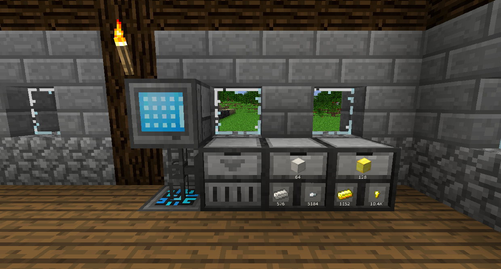

# 纜線和管理

您可以只使用面板和硬碟櫃，但您將錯過數位存儲的絕佳之處。

纜線用於將設備連接到系統中樞。如果面板和其他精緻儲存的方塊直接接觸系統中樞（或接觸其他 RS 方塊），則它們可以工作，但纜線允許您連接更遠的東西。

輸入纜線會將物品從其放置的庫存中取出並將它們輸入到精緻儲存系統中。您可以通過打開輸入纜線的 GUI 來指定要輸入的內容。

輸出纜線會將物品從 RS 系統推出到其放置的庫存中。您可以通過打開輸出纜線的 GUI 來指定要輸出的內容。

外部儲存纜線允許您從 RS 系統內部查看放置它們的庫存的內容。

如果外部儲存纜線比其他存儲方塊（如硬碟櫃）具有更高的優先級，則項目將在進入磁盤之前嘗試進入外部儲存纜線所在的庫存。

解構纜線將破壞它所面對的任何方塊並將其放入 RS 系統。您可以在其 GUI 中設置要破壞方塊的黑名單或白名單。

結構纜線將從 RS 系統放置一個指定的方塊到世界中。

讀取器和書寫器一起讓您可以在不使用輸入纜線和輸出纜線的情況下傳輸能量、紅石信號、流體和物品。將讀取器放置在您想要獲取內容的位置，並將書寫器放置在您希望它們去的位置。打開他們的菜單並選擇您希望他們連接的頻道。如果頻道已經存在，只需單擊它。如果該頻道尚不存在，請輸入您要為其指定的名稱，然後按 Enter 鍵以創建該頻道。
書寫器不會將物品或流體推入它所面對的方塊中，您必須使用漏斗或任何其他自動化方法將其拉出。

中繼器的工作方式類似於纜線，但在收到紅石信號時會關閉。

介面允許您從單個方塊自動導入和導出。
任何通過管道輸送到其中的物品都會自動進入系統。
放置一個項目並在介面輸出插槽中指定數量，介面將嘗試將該項目的數量保留在底行，可以通過管道輸出。