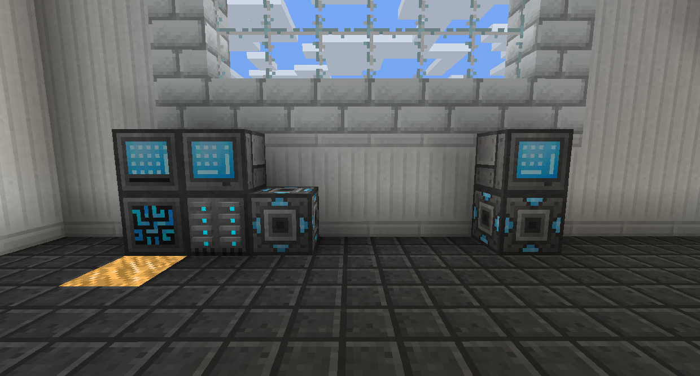
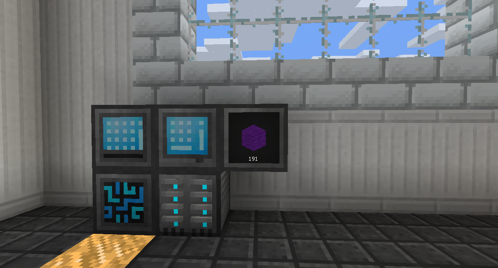

# 其他

網路傳輸器、網路接收器和網路卡協同工作，讓您可以遠距離無線連接電網和其他模塊。

將網路傳輸器放在您的基地，連接到系統中樞。
將網絡接收器放在其他地方，然後使用網卡潛行右鍵卡以將其設置為該接收器。
將網卡放入傳輸器，它將連接到接收器。

網絡傳輸器可跨維度工作。

儲存監控器的作用基本上類似於儲物抽屜，但連接到您的 RS 系統。用空手潛行右鍵單擊它以打開它的菜單，您可以在其中設置要顯示的塊。然後，你可以用它來取出單個項目，潛行來取出一整組，或右鍵單擊以放入。

攜帶式面板的工作原理有點像數位背包。將任何類型的硬碟放在右上角的插槽中，您就可以在它有電時訪問其內容。

無線傳輸器允許您使用任何類型的無線面板在其自身的 16 個方塊內訪問 RS 系統。
要將無線面板設置為 RS 系統，請在系統中樞上潛行右鍵單擊它。

偵測器將根據其設置方式發出紅石信號。您可以將其設置為在超過、低於或恰好特定數量的特定項目或流體時發射。如果您想保留必須製作的特定事物的積壓，但又不希望它一直運行，這將非常有用。

升級可以對不同的機器做各種事情。

範圍升級將使無線傳輸器的範圍增加 8。

速度升級將提高輸入設備的速度，例如合成器。

如果沒有可用的項目合成升級將使介面和輸出纜線嘗試製作它正在輸出的項目。

堆疊升級將使輸入纜線和輸出纜線一次拉和推一個堆棧。

絲綢之觸和幸運升級級可以安裝在上，使其在解構纜線破壞方塊時應用該附魔。