# 儲物抽屜-Storage Drawers

儲物抽屜是一個可讓您存儲大量單件物品的模組。
右鍵單擊抽屜表面上的一個項目來存儲它，或者雙擊鼠標右鍵將所有該項目存儲在您的物品欄中。左鍵單擊取出一件物品，或潛行左鍵單擊取出一組。

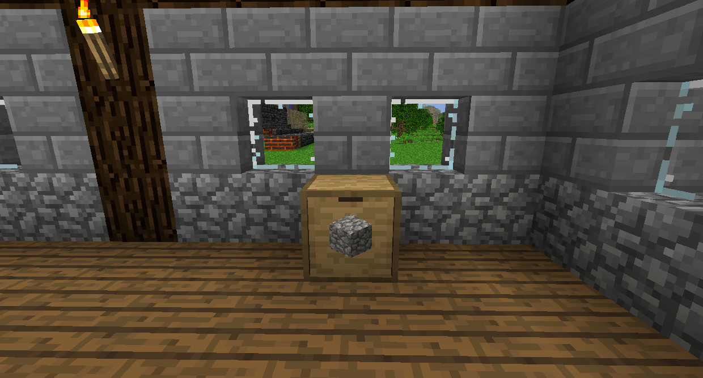

基礎抽屜可存放 32 組單件物品。
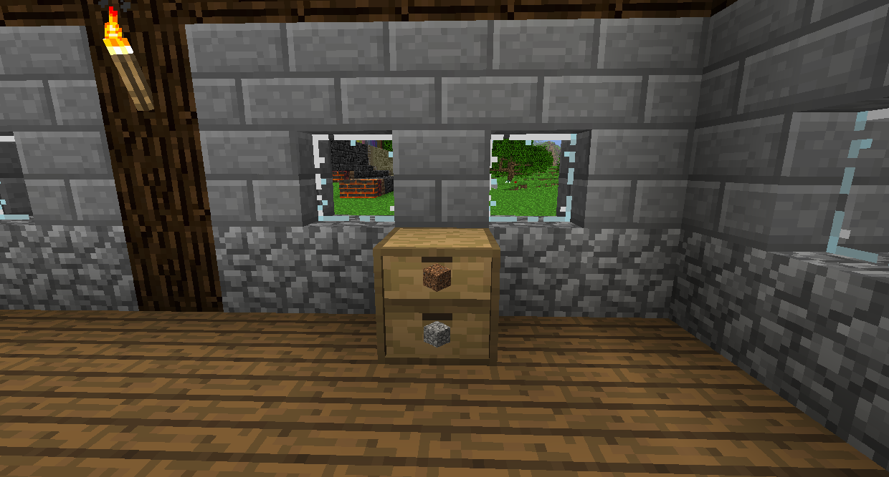

基礎抽屜 1x2 可在其每個隔間中存放 16 組單件物品。
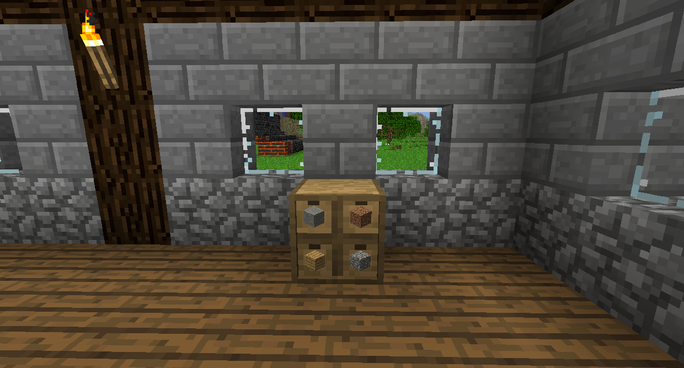

基礎抽屜 2x2 可在其每個隔間中存放 8 組單件物品。
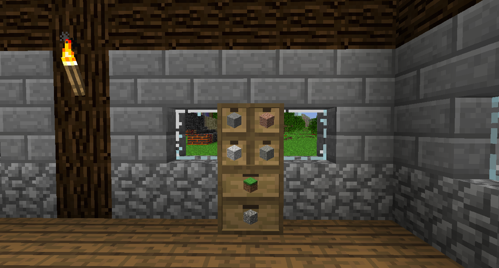

還有半塊版本的多隔間抽屜，可容納正常數量的一半。

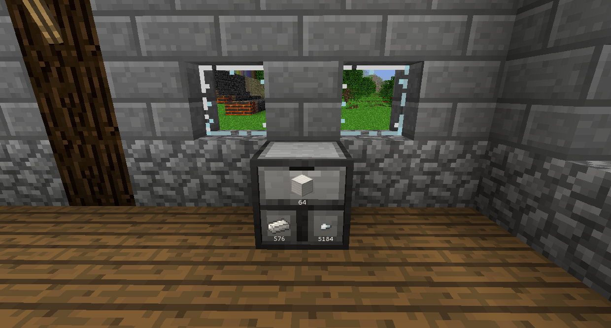

壓縮抽屜將顯示每種形式的項目。如果它是從 3x3 合成的，並且可以用 3x3 配方合成，那麼兩者都會顯示在這裡。這非常適合儲存金屬。存儲升級將適用於最大的版本，因此存儲升級 (V) 將允許您存儲 32 倍的鐵塊。

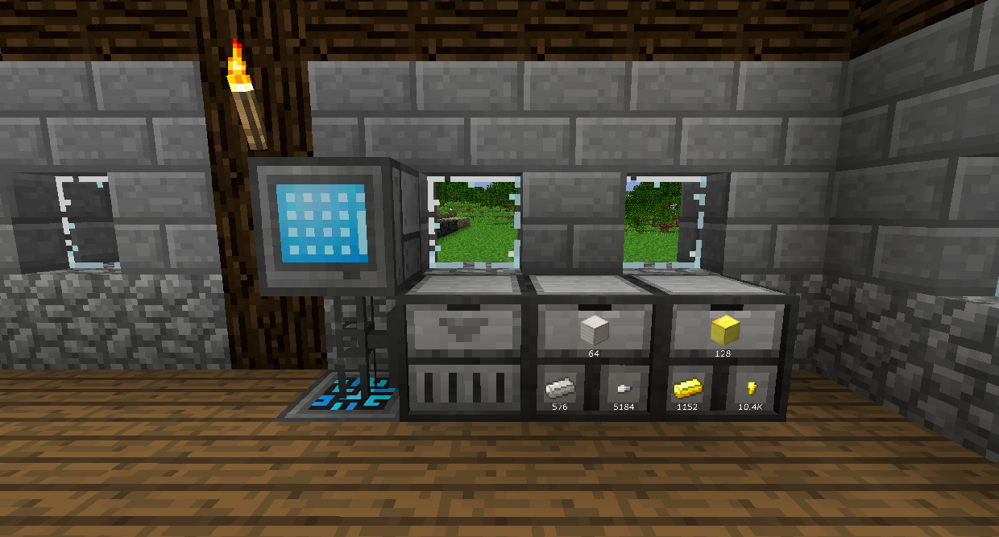

抽屜控制器將允許您訪問 12 個方塊內所有連接的抽屜。它本質上就像一個單獨的抽屜，在每個連接的抽屜中都有所有項目。
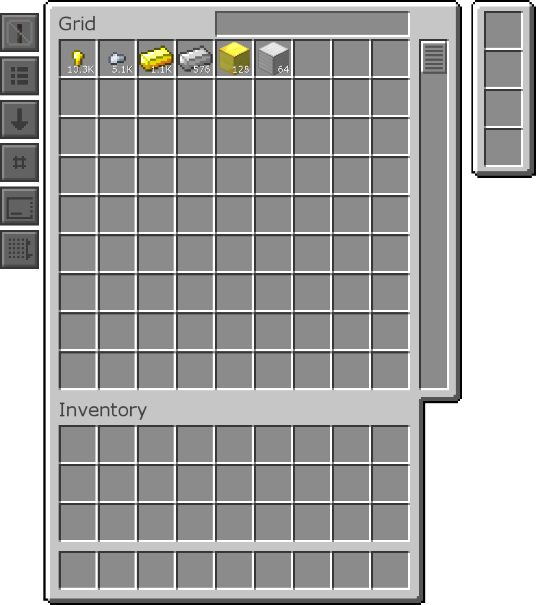

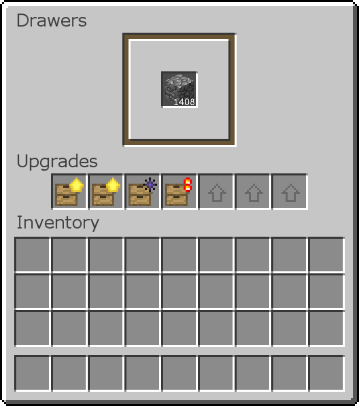
你可以空手在正面上潛行右擊打開抽屜的菜單，在那裡你可以看到存儲的物品數量，以及安裝的任何升級。

升級可以對抽屜做一些特殊的事情，通常比如增加它可以存儲的物品數量。升級的工具提示會告訴你它的作用，但它們也會在這裡被掩蓋。

抽屜容量升級會將最大存儲增加正常數量的係數。更高的等級將增加更多的數量。您不需要上一層級來使用更高層級，這意味著如果您願意，您可以擁有 7 個最大層存儲升級（這將存儲正常數量的 224 倍）。

抽屜容量降級將執行相反的操作，將最大存儲設置為 1 組。

狀態顯示升級將在抽屜的表面添加一個欄，以顯示它有多少。第一層只有在它滿時才會亮起，第二層會根據它的滿度而部分亮起。

如果抽屜已滿，虛空升級將銷毀收到的物品。當您存放經常使用的一次性物品（例如鵝卵石）時，這非常有用。

紅石升級將使抽屜根據其存儲的物品數量發出紅石信號。

還有一些其他物品對抽屜有用。
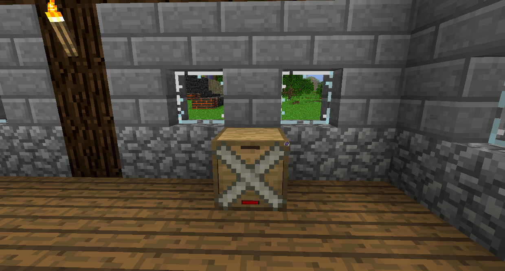

通常，當您打破抽屜時，所有物品都會彈出並弄得一團糟（如果太多，遊戲就會Lag，所以絕對不要這樣做）。您可以使用儲物抽屜的膠帶，這樣您就可以在不丟失物品的情況下破壞它。
請注意，如果您在製作配方中使用抽屜，它將破壞其中的所有物品。

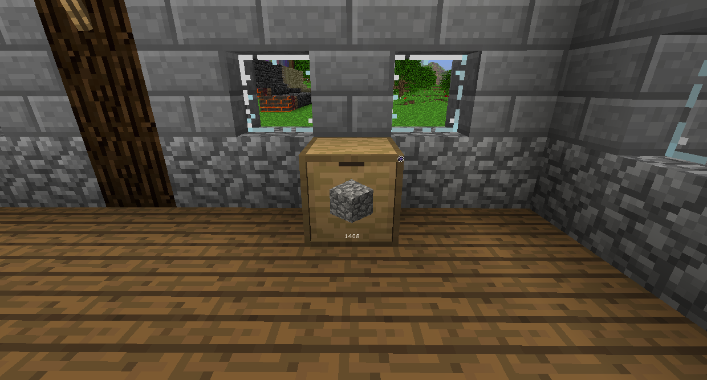

數量鑰匙將顯示存儲的項目的確切數量。

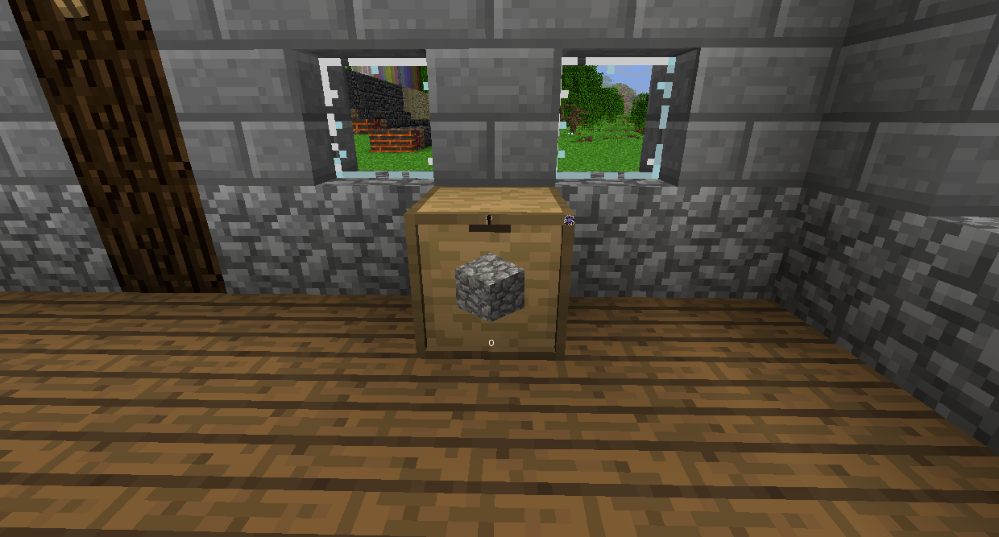

綁定鑰匙會將抽屜鎖定到該物品上，因此即使它用完也無法裝其他任何東西。

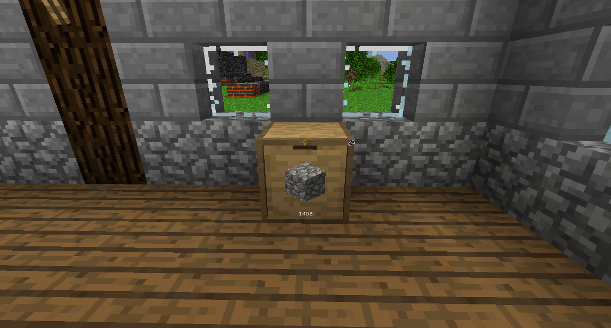

私人鑰匙將使只有您可以與抽屜互動。然而，管道和其他自動化仍然可以。

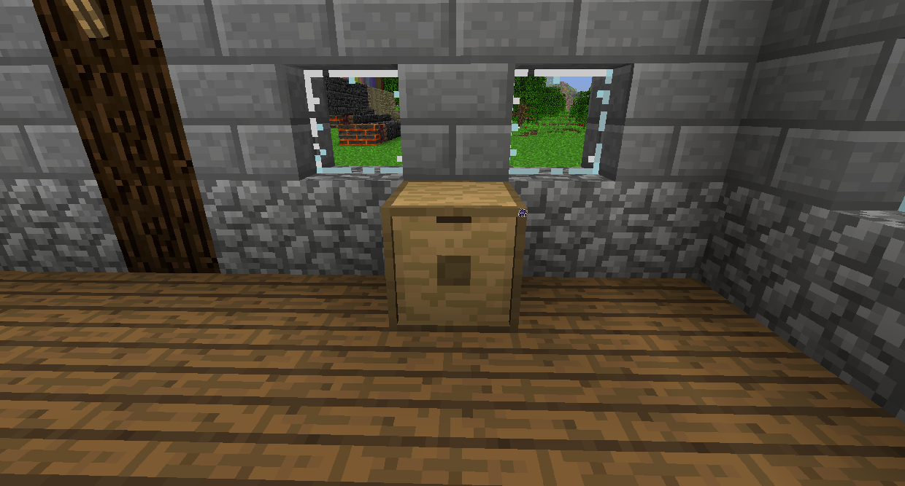

屏蔽鑰匙將隱藏該項目。

您可以通過在抽屜上右鍵單擊它們來使用這些鑰匙，或者右鍵單擊抽屜控制器以將其應用於所有連接的抽屜。