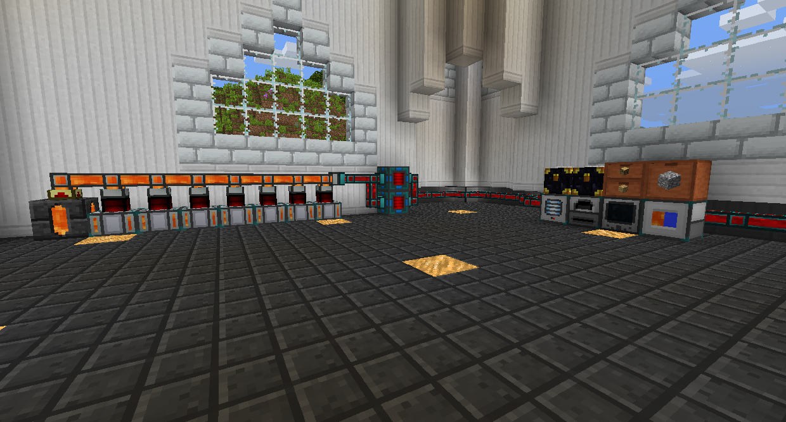

# [科技!](https://www.youtube.com/watch?v=Fc1P-AEaEp8)
### 這就是樂趣的開始

科技模組可能是模組化 Minecraft 中最大的部分。

科技模組與產生和使用電力來做事有關。自動採礦和加工礦石在科技模組中很常見。

大多數科技模組使用相同的能源系統 Forge Energy (FE)。然而，很多模組使用他們自己的花俏名稱，例如來自 Thermal Expansion 的 Redstone Flux (RF)、來自於 actual Additions 的 Crystal Flux (CF) 等。它們幾乎總是相互兼容，除了一些具有獨特的能源系統，只與自己合作，如使用Energy Units (EU) 的 IndustrialCraft 2。
