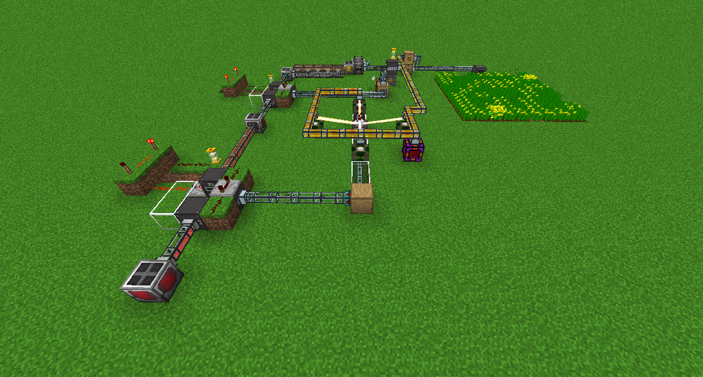

# 實用擴展-Actually Additions

這些都是由實用擴展添加的發電機。

太陽能板在陽光直射時產生 8 RF/t。

熱能發電機在接觸至少 4 個岩漿源塊時產生 40 RF/t。然而，它有可能每隔一段時間就摧毀其中一個。

咀葉發電機破壞自身 7 格內的樹葉，每格產生 300 RF。

生物反應器從其庫存中的植物物質中產生RF。物品種類越多，產生的 RF 就越多。

原油發電機可以用菜籽油製造RF。您可以使用多種級別的油，它們的製作過程相當複雜。單擊頂部的頁面以閱讀更多信息。

