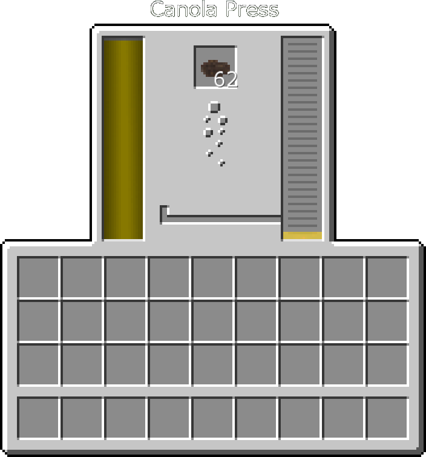
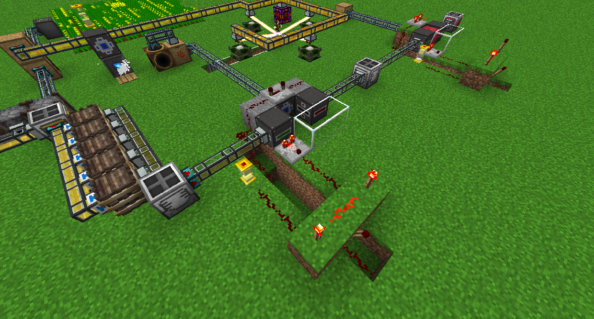
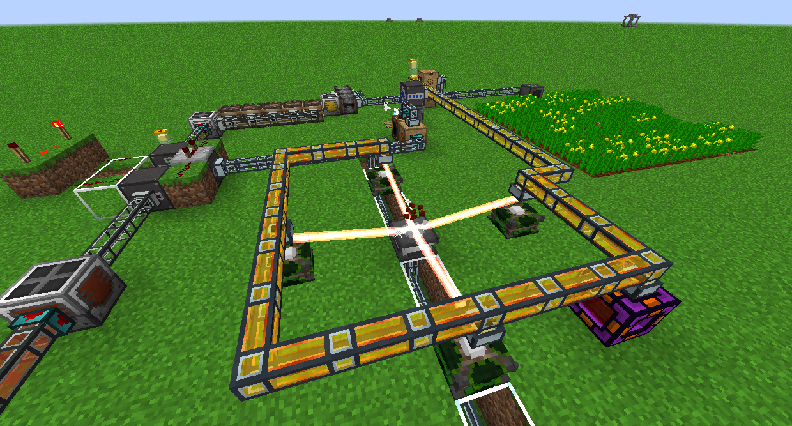
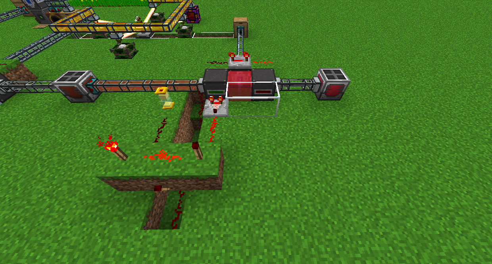

# 菜籽油

首先，您需要種植一些油菜種子。你可以使用任何你想要的農業方塊。

接下來，將油菜放入油菜壓榨機中以製作菜籽油。菜籽油以 40 RF/t 的速度產生 80,000 RF，或者您可以繼續加工油以使其更好。

將菜籽油移入發酵桶（您可以將發酵桶直接放在油菜壓榨機旁邊），它會變成精製菜籽油，以 80 RF/t 的速度產生 192,000 RF。

接下來，將普通的油菜籽放在原子再構機前，製作一些晶化油菜種子。

將其放入一池精製菜籽油中。在圖片中，比較器用於檢查流體成型器中是否含有至少 1,000mB 的精製菜籽油。如果是這樣，它會提供 2 個紅石動力，這些紅石粉連接到原版紅石 AND gate 的一半。另一半由一個帶有 4 個沙子的懸浮沙漏提供，持續 4 秒。如果兩者都打開，它會為流體成型器和自動精準投擲器供電，暫停，然後為流體吸收器供電。

晶化油以 100 RF/t 的速度產生 560,000 RF。

最後一步，將晶化油菜種子放在充能台上，並用 4 顆普通油菜籽包圍它。這將製作充能油菜種子。

將其放入一池結晶晶化油中，方法與精製菜籽油相同。

充能油 以 120 RF/t 的速度產生 960,000 RF。