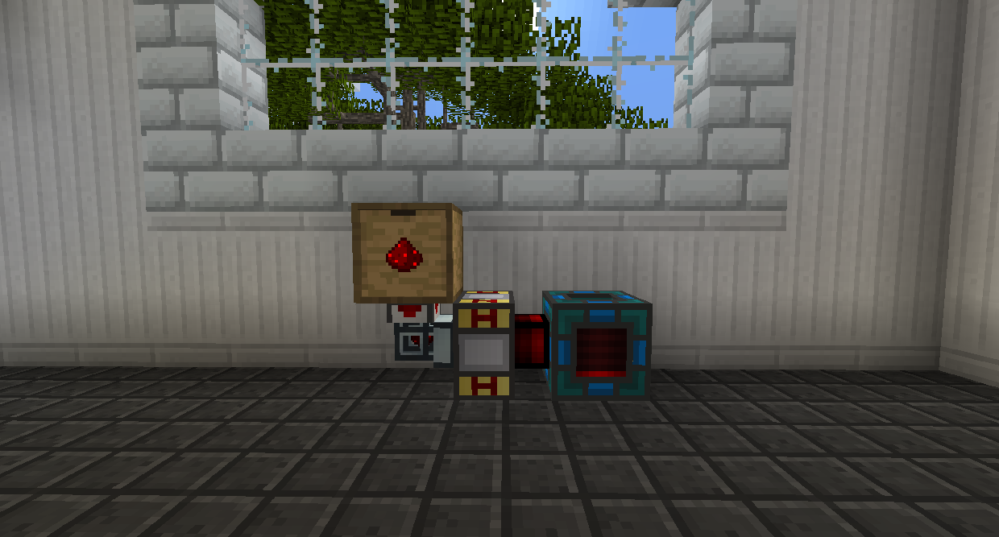

# 熱力膨脹發電機

Thermal Expansion 添加的所有發電機都稱為能源爐。您可以將物品和/或流體從線圈（較細）以外的任何一側通過管道輸送到其中，除非您在發電機上安裝了增強裝置：物流線圈，並可以從線圈中拉出 RF。

與大多數其他熱力膨脹機器一樣，能源爐是分層級的。更高的層級會更快地生成 RF。他們不會製造更多的 RF，他們只是花費更少的時間來製造相同的數量。要增加能源爐的等級，請使用下一個等級的升級套件或您要跳轉到的等級的轉換套件右鍵單擊它。按順序排列如下：
•基本的
•硬化
•強化
•信素
•諧振

如果能源爐有燃料，即使它們沒有地方儲存它，它們也會不斷地產生RF。 您可以安裝增強：勵磁場限制器，使它們在充滿時停止工作，以防止浪費燃料。

以下能源爐的名稱是指向其各自 wiki 頁面的鏈接。

[蒸汽能源爐](https://teamcofh.com/docs/thermal-expansion/steam-dynamo/)
使用固體燃料和水產生RF。

[熱力能源爐](https://teamcofh.com/docs/thermal-expansion/magmatic-dynamo/)
使用熱流體產生RF。

[壓縮能源爐](https://teamcofh.com/docs/thermal-expansion/compression-dynamo/)
使用流體燃料和冷卻劑產生RF。

[反應能源爐](https://teamcofh.com/docs/thermal-expansion/reactant-dynamo/)
使用流體燃料和固體反應物產生RF。

[弱化能源爐](https://teamcofh.com/docs/thermal-expansion/enervation-dynamo/)
使用紅石或放電物品產生RF。

[通貨能源爐](https://teamcofh.com/docs/thermal-expansion/numismatic-dynamo/)
使用貨幣生成 RF。
