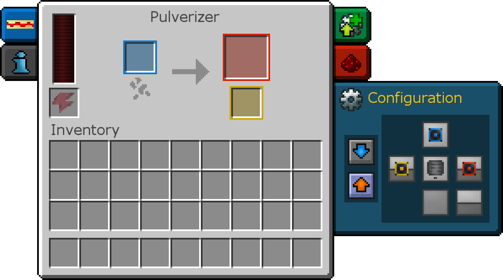

# 機器

現在我們有了生產和傳輸 RF 的方法，我們需要一些東西來使用它！
機器總是提供某些功能，並且通常由RF供電。他們可以做一些事情，比如自動挖掘方塊、處理材料、儲存和自動製作物品等等。

熱力膨脹的機器是分層級的。更高的層級工作得更快，並且有更多增強的插槽。要增加機器的等級，請使用下一個等級的升級套件或您要跳轉到的等級的轉換套件右鍵單擊它。按順序排列的層如下：
•基礎
•硬化
•強化
•信素
•諧振

熱力膨脹的機器允許您從方塊的某些側面的相鄰庫存中自動拉動和推動。例如，您可以使其自動從其上方的庫存中拉出，然後自動將輸出品推到右側。為此，請打開機器清單中的配置按鈕。每個插槽都有顏色編碼。

單擊方塊的一側將更改它將設置的插槽。上圖中，物品從頂部輸入，主輸出從右邊推出，次輸出從左邊推出。
您可以單擊橙色和藍色箭頭來切換機器是否自動推出或拉入物品。如果禁用，則必須通過管道輸入和輸出它們；如果啟用，他們將自己拉和推。