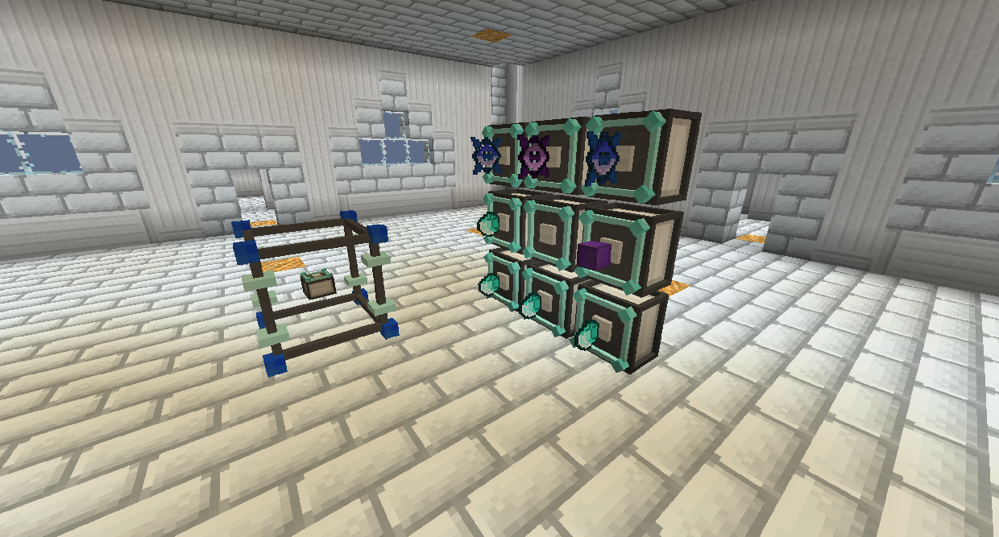
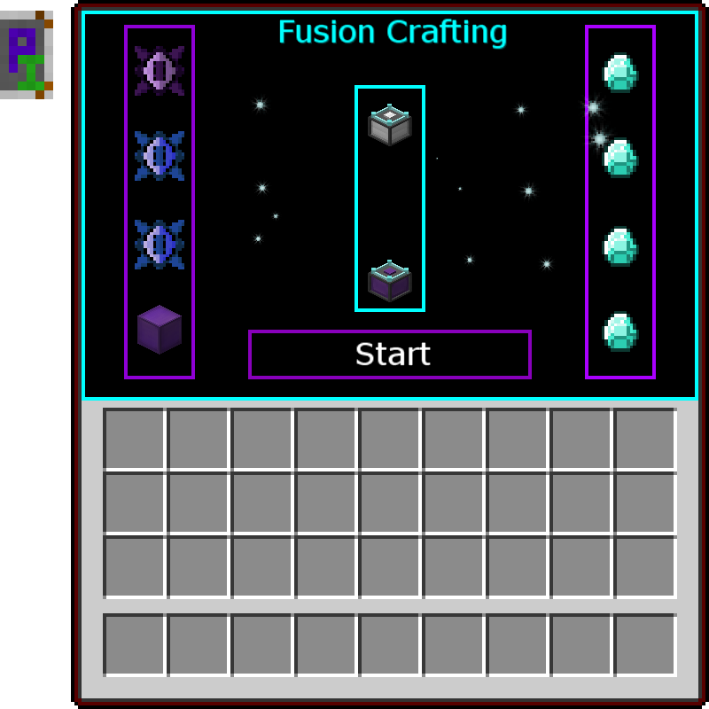
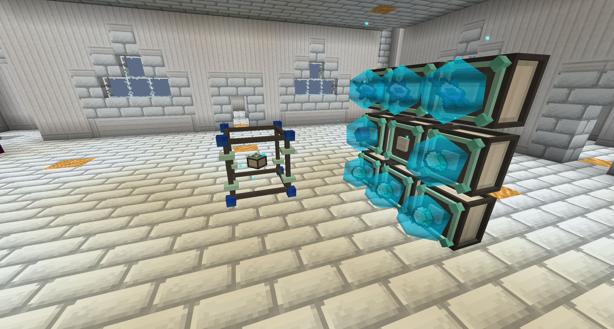
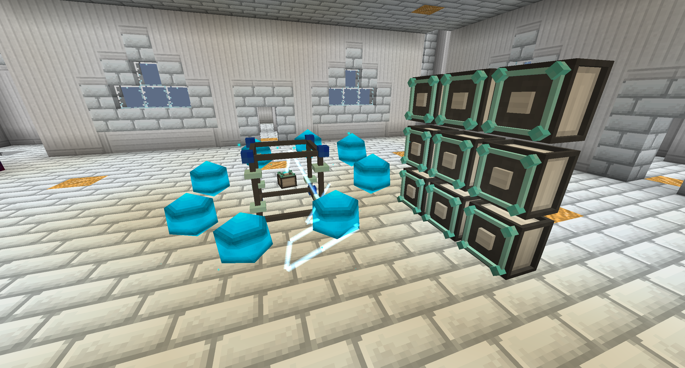

# 融合製作

融合製作使用大量能量來製作物品，將它們組合成新的東西。

將聚合裝置核心放置在您希望結構所在的位置的中心。

將聚合裝置注入器放置在任何方向，只要它位於 3x3 區域內，中心與聚合裝置核心對齊。

有多個層級的聚合裝置注入器。更高層級可以使用更多配方。

將主要的製作材料進入聚合裝置核心，然後將每種次要材料之放入聚合裝置注入器。順序和位置無關緊要。

一旦所有物品都位於正確的位置，打開聚合裝置核心並單擊“開始”。聚合裝置注入器將開始充滿所提供的能量，然後一旦充滿電，它們將開始與主要作材融合。

