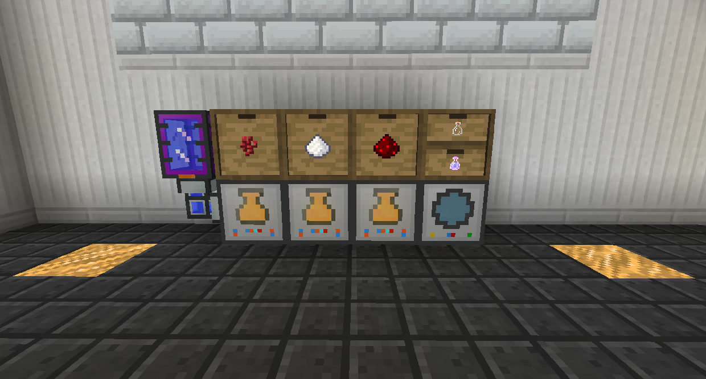

# 機器製作

壓縮機可讓您將錠壓成板，將烈焰粉壓成烈焰桿。

離心機可讓您取消組合物品和方塊，取回它們的組件。

循環裝配台允許您設置製作配方，然後在其庫存中有所需物品時讓它自動合成。

藥水釀造機將液體和物品結合起來製作藥水。它產生的藥水是流體，你必須將它們送到流體轉置機才能將它們放入瓶子中。
如果您想製作更複雜的藥水，最好將多個藥水釀造機串聯放置。

附魔機使用知識精華和一件物品來為書附魔。您可以使用它來獲得模組包中的幾乎所有附魔。
