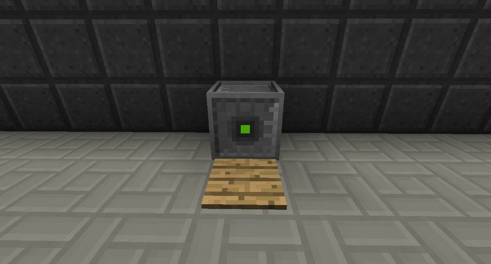

# 原子再構機

原子再構機使用 RF 將物品轉換為其他物品。
這主要用於製作各種水晶，這是許多機器的製作組件。
它還有其他幾種用途，例如將沙子變成靈魂沙或將地獄石英變成海晶。將鼠標懸停在該物品上時按 U 可查看其所有用途。

原子再構機的工作原理是發射雷射，它會在它擊中的區域周圍轉換物品。
預設情況下，它會在有電時發射。您可以使用紅石火炬右鍵單擊它，使其僅在給予紅石脈衝時才起作用。

您可以將透鏡附加到原子再構機以更改其工作方式。透鏡可以使雷射爆炸，殺死小怪，上色方塊，將附魔從物品移動到書上，並生成礦石。
