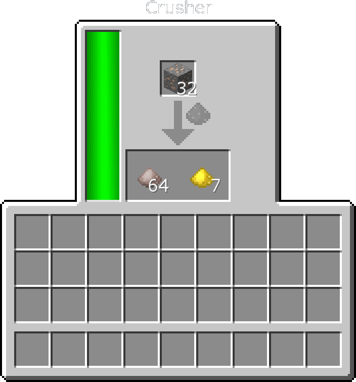
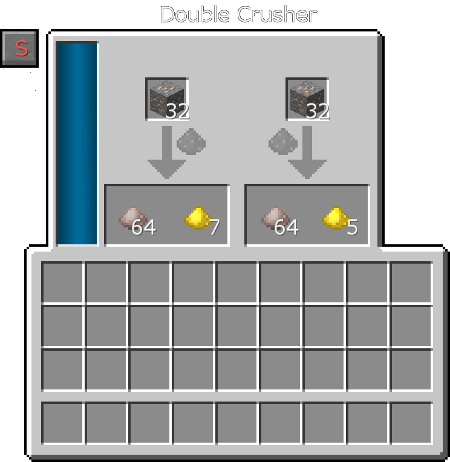
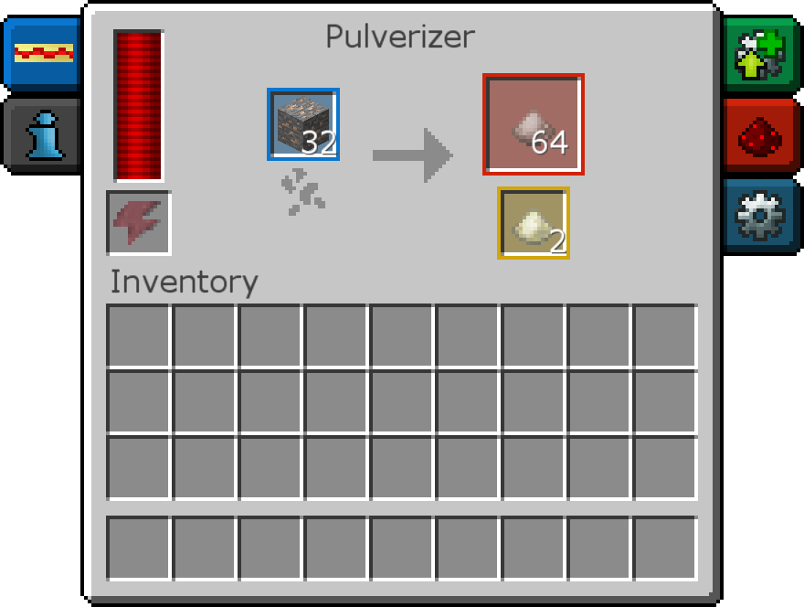
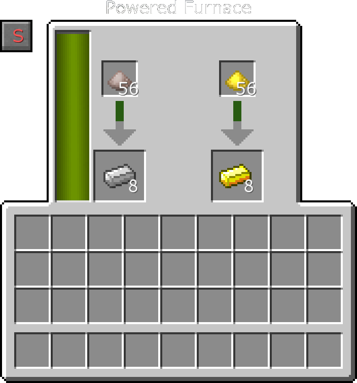
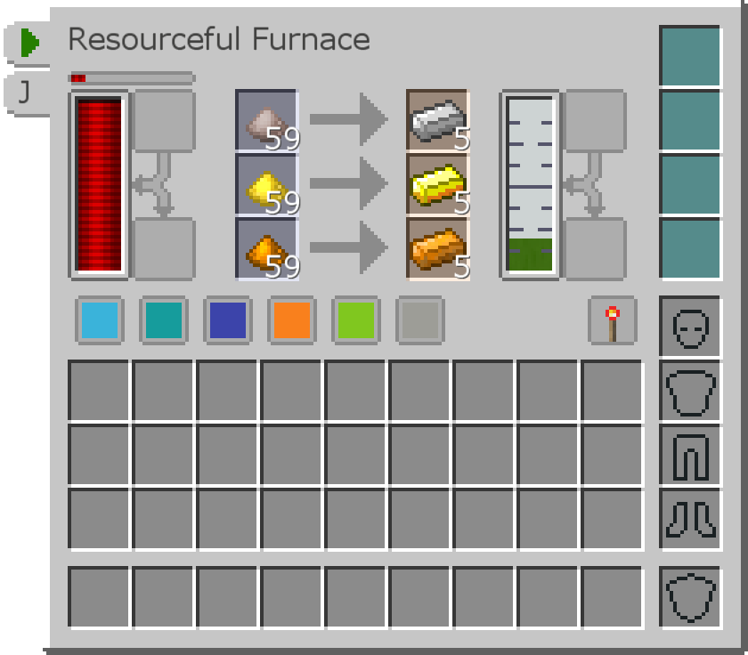
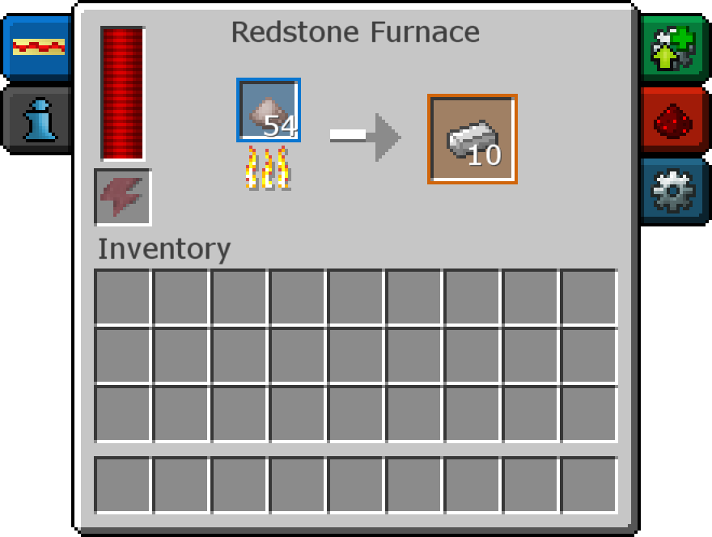

# 礦物處理

大多數科技模組都添加了一種將一個礦石變成多個錠的方法。這通常是通過將一個礦石磨成 2 個粉末，然後將每個粉末熔煉成一個錠來完成的。

[您可能可以使用的第一種將礦石加倍的方法是 Tinkers' Construct 中的冶煉爐。單擊此處在指南中打開其頁面。](guide:/modpack/gear/tinkers_construct/smeltery/)

## 礦物雙倍化
至於實際的技術方法，因為它們需要RF，您可以嘗試熱力膨脹的粉碎機或是用擴展的磨粉機和兩倉磨粉機。

磨粉機在處理材料時有機會產生二倍輸出。

兩倉磨粉機的工作原理相同，但有 2 個輸入。您可以設置它，使其自動將項目拆分到兩個輸入上，從而有效地以兩倍的速度運行。

粉碎機也有機會產生二倍輸出。它可以升級和增強以更快地工作並生產更多的副產物。

您可以將 升級：板塊礦質引發 安裝到粉碎機上，它會以板塊之層岩的額外成本提供額外的礦石輸出。

## 燒煉
既然你有辦法將礦石加倍變成粉末，你只需要冶煉它們。你可以使用普通的熔爐，但那很無聊！有很多機器可以使用 RF 進行燒煉。

兩倉熔爐可以同時熔煉 2 個物品。您可以將其設置為將內容拆分到兩個輸入上，以便有效地達到兩倍的速度。

高級熔爐有三個輸入槽，使用時會產生少量的精華（可以轉化為經驗）。

紅石爐只有一個輸入，但可以升級和增強以更快地工作。

您可以將升級：通量陽極電鍍安裝到紅石爐，它將一步提供額外的礦石輸出，而不必先研磨它。但是，紅石爐只能在安裝了升級時熔煉礦石。