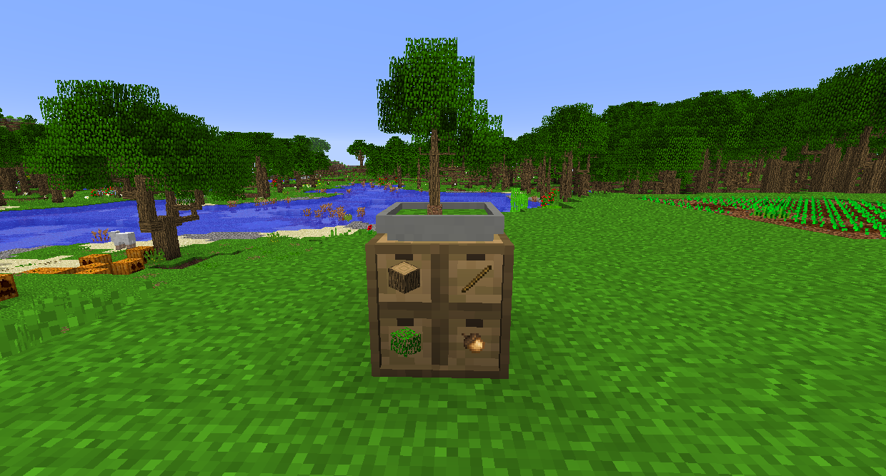

# 農業作物

種植木材的最簡單方法是在庫存頂部放置一個漏斗盆景盆。它會給你無限量的木頭、樹葉和樹枝，但速度非常慢。最好早點這樣做，然後再做一些更複雜的事情。

工業先鋒使用多台機器來種植和收穫農作物和樹木。工作區域可以是從 1x1 到 25x25 的任何地方。

實用擴展的農場可以種植和收穫莊稼。它適用於 9x9 區域。

熱力膨脹的有機灌注器可以在其內部庫存中種植農作物和樹木，而無需進行實際種植。
