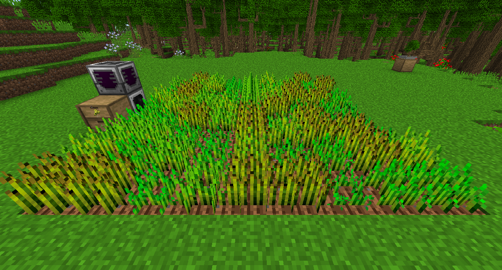
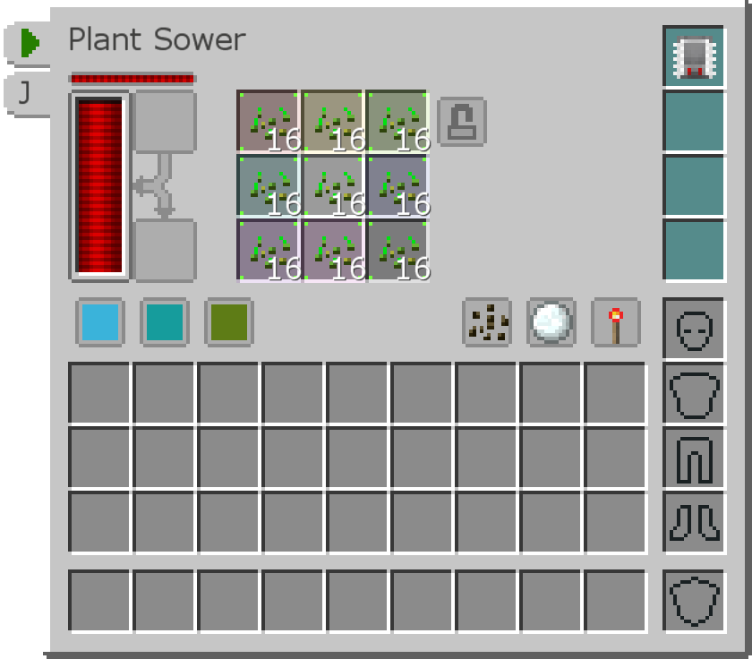
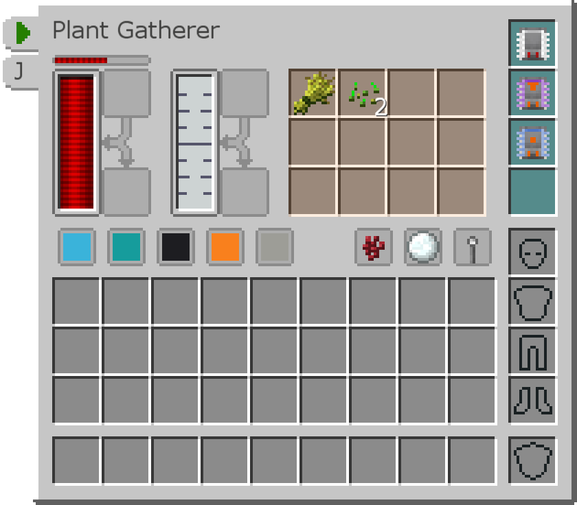
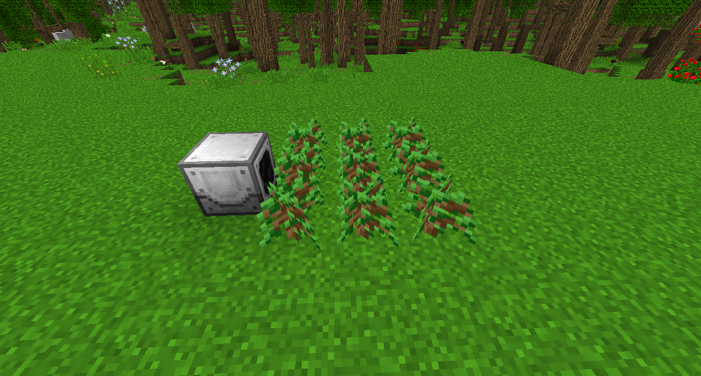

# 工業先鋒

您可以結合使用播種機（播種種子）和植物收割機（收穫作物）來種植大多數植物。

將播種機放在種植區域的中心下方。它的默認範圍為 1 個方塊，因此要將其增加到在 9x9 區域內工作，您必須使用範圍升級 +4 插件。

將種子插入槽中。種子只會在播種機的相應槽位中種植。也就是說，如果只有前三個插槽中的種子，則只有北方三分之一的工作區域會有種子。

面向收割機區域。同樣，它需要一個範圍升級 +4 插件才能在 9x9 區域內工作。它將掃描工作區域（您可以單擊雪球以將其顯示在世界中）以尋找完全生長的作物並打破它們，將其插入其內部庫存中。它還會產生少量的污泥。

在上面的示例中，使用物品傳輸插件自動將種子和小麥移動到相鄰的儲物抽屜中。物品管道將種子移回播種機。流體傳輸插件也用於自動將汙泥移動到上面的黑洞儲液罐中。

