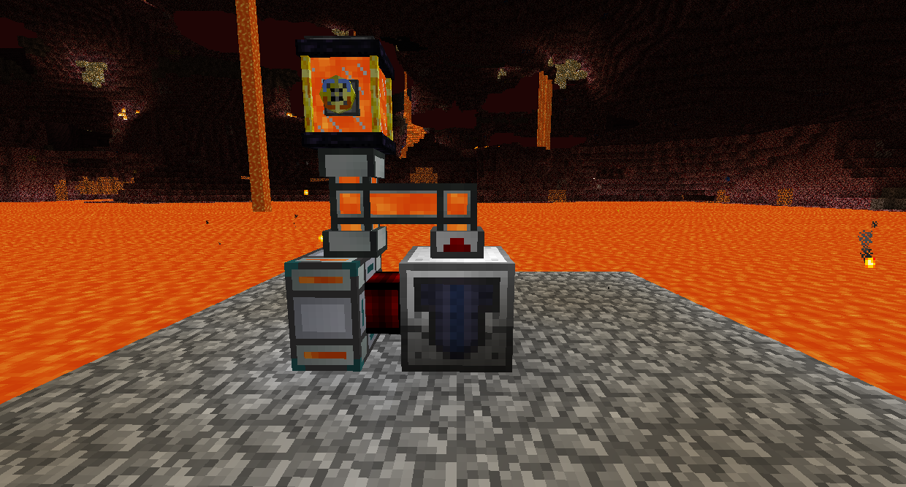
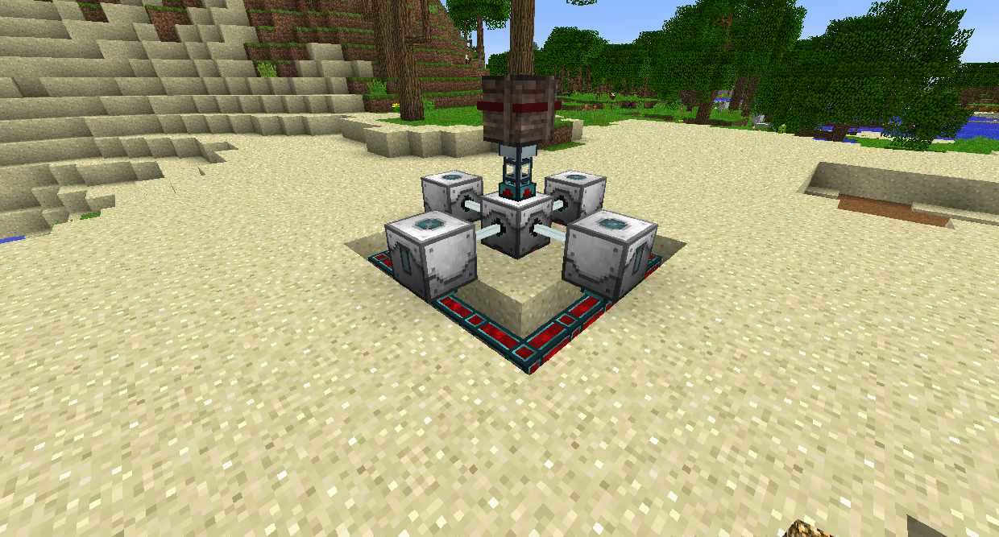
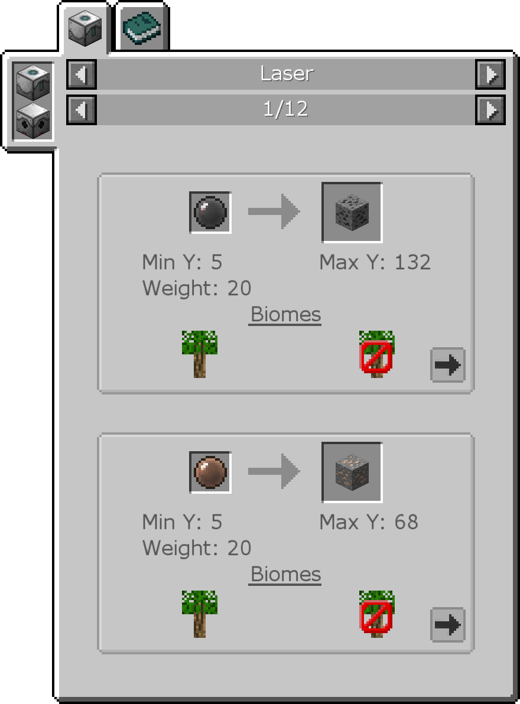
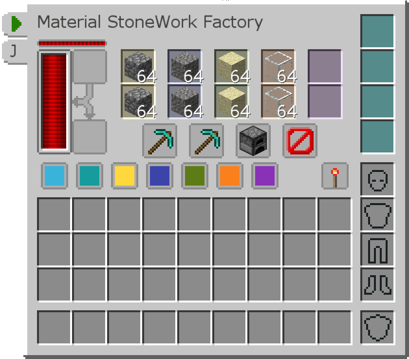

# 礦物和流體收集

流體泵將檢查直接位於其下方的流體，然後將工作區域中的所有流體泵入其內部儲罐，在那裡可以通過管道排出。泵送的液體將被鵝卵石代替。

它的預設工作區域只有 1x1，因此您需要在為其供電之前插入範圍升級插件以使其在該區域工作。

鐳射鑽基座和鐳射鑽協同工作，僅從能量中生成礦石。將鐳射鑽基座放在任何位置，然後用 4 個鐳射鑽圍繞它，將這些鐳射鑽面向它，它們之間間隔一個方塊。為鐳射鑽提供電源，它將開始生成礦石。

鐳射鑽基座根據您設置的深度生成礦石。打開它的 GUI，您可以通過按 -和 + 按鈕更改它設置的挖掘深度。您還可以將鐳射聚焦透鏡插入左側的 6 個插槽中，以增加開採與該顏色相關的礦石的機會。將鼠標懸停在物品欄中的鐳射鑽基座上方時按 U 以查看每種礦石的最佳深度和激鐳射聚焦透鏡組合。

造石加工機將使用 RF 來生成鵝卵石。它還可以通過單擊列之間的按鈕將圓石自動轉換為您可以用鵝卵石製作的其他方塊。例如，您可以先將鵝卵石磨成礫石，然後再磨成沙子，然後熔煉成玻璃，而無需離開方塊，從而使其生成玻璃！

