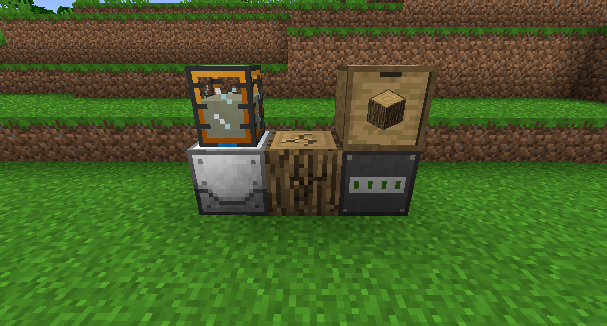
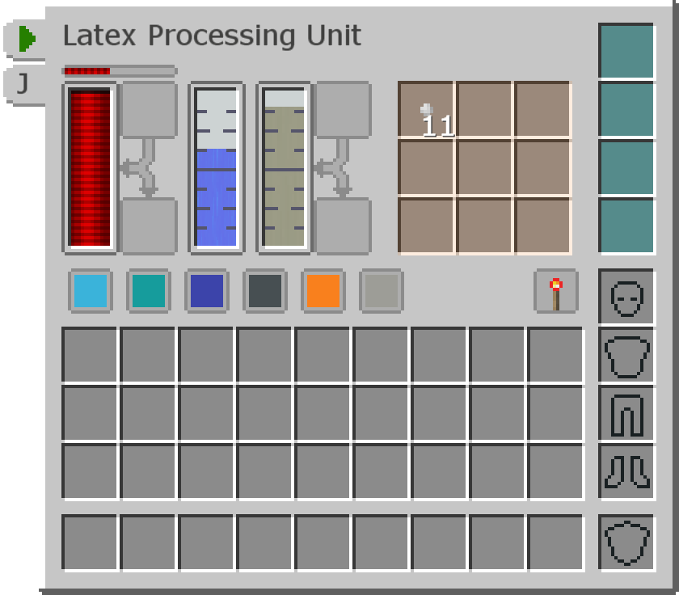

# 塑料

工業先鋒中的幾乎每台機器的製作配方都需要塑料片。本頁將教您如何獲得。

樹液提取器會慢慢地破壞它所面對的原木，在它的內部水箱中慢慢地產生液態膠乳。
原木最終會損壞，所以如果你想完全自動化它，你應該使用一個裝滿原木的自動放置器。

膠乳加工機將結合 75mB 的液體膠乳和 1000mB 的水來製造 1 塊小塊乾橡膠。將其中的 9 個組合在一起以獲得乾橡膠，可以將其熔煉以製造塑料片。
