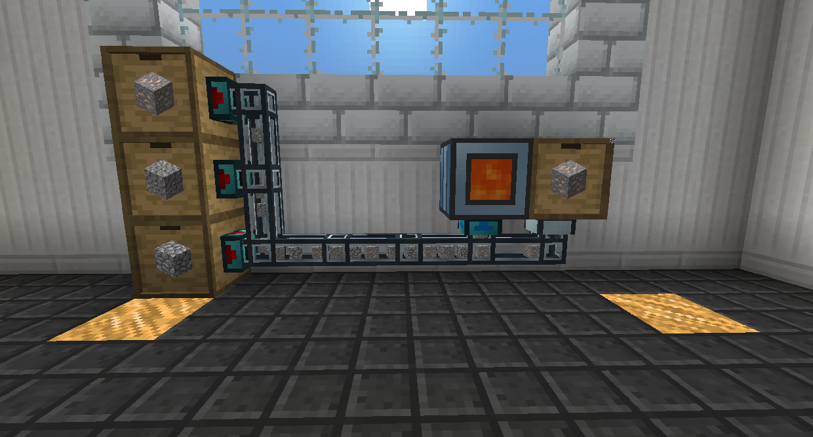

# 傳輸

本章致力於將東西從一個地方移動到另一個地方的方法，無論是能量、物品、流體還是玩家。
管道是這些頁面的常見元素，這裡需要更多解釋。

## 管道

物品管道和流體管道需要伺服器或檢索器才能運行。

伺服器用於從庫存或儲罐中提取物品或液體。

將伺服器放在連接上並為其提供紅石信號（或打開其 GUI 並將其設置為不需要），它將開始提取物品/流體。

物品只有在有地方可以去時才會提取，但無論如何都會提取流體。

物品會嘗試去最近它可以進入的庫存，而流體只會填充它可以填充的任何東西。

如果伺服器發送了一個物品但它無處可去，該物品將返回到伺服器和後備箱。如果有地方可以放置物品，後備箱的伺服器將再次開始工作。

您可以通過使用新月錘右鍵單擊來斷開管道之間或管道與方塊之間的連接。

檢索器的工作方式與伺服器相同，但它們被放置在目的地而不是來源上。如果您有多個要提取的來源，這將很好用。

過濾器放置在目的地並限制可以進入的物品或流體。

您可以在伺服器、檢索器和過濾器上設置過濾器。更高層級具有更好的可定制性，具有更多插槽和選項。

• 白名單中的項目是唯一允許的項目，黑名單中的項目是唯一不允許的項目。
• 數據值 匹配工具損壞之類的內容，因此如果您只想允許未損壞的項目，您將需要使用數據值。
• NBT 匹配諸如物品內容之類的東西，因此如果您只想接受裝有特定流體的桶，您將需要匹配 NBT。
• 礦物詞典允許多個項目充當相同的事物，因此如果您想接受所有類型的木材，您最好不要忽略礦物詞典。
• 如果您想允許來自 實用擴展 模組添加的內容，您可以將任何項目放入其中，然後將其設置為匹配 MOD 歸屬。
• 您可以切換超額發送，以允許管道嘗試放入比正常情況下可以放入更多的項目。這對於焚毀爐尤其有用，它只有一個插槽，但會刪除進入它的任何內容。