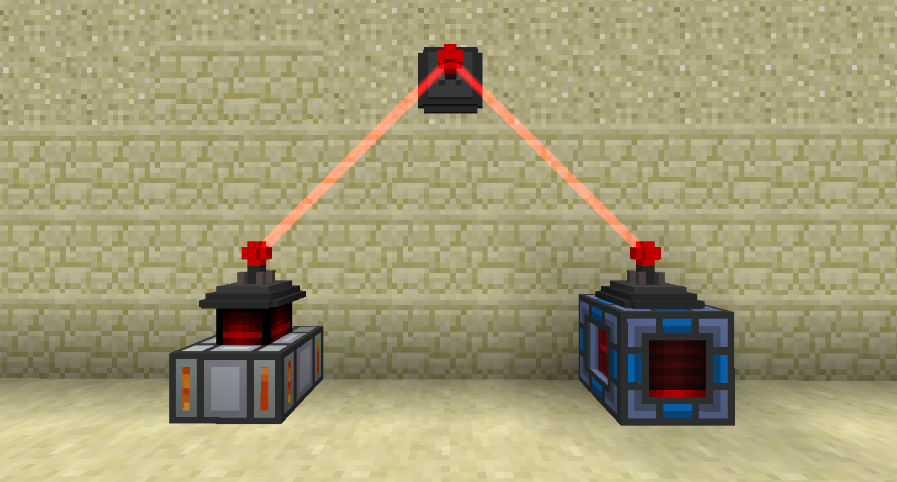

# 能量雷射中繼器

能量雷射中繼器可以無線傳輸RF。

要連接能量雷射中繼器，請使用中繼器扳手右鍵單擊它們。

RF 可以進出網絡中的任何中繼。網絡的輸入和輸出之間也有輕微的能量損失，所以你得到的會比你輸入的略少。這僅在輸入和輸出之間，僅連接到其他中繼器的數量無關緊要。

能量雷射中繼器可以傳輸 1,000 RF/t。

進階能量雷射中繼器可以傳輸 10,000 RF/t。

超級能量雷射中繼器可以傳輸 100,000 RF/t。

如果您在兩個較高級別的中繼器之間有一個較低級別的中繼器，則將使用最低的傳輸速率。