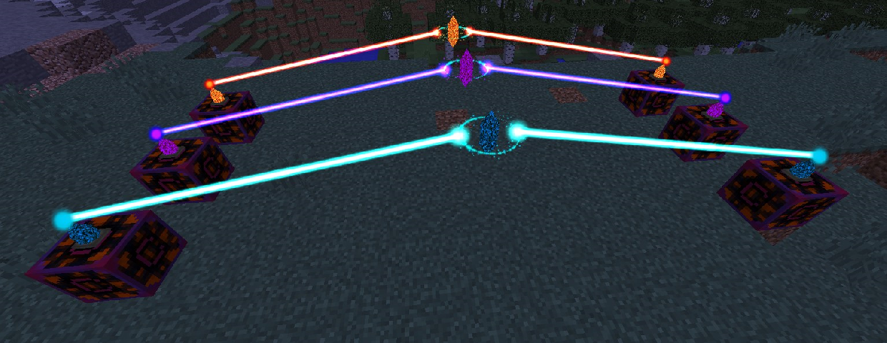
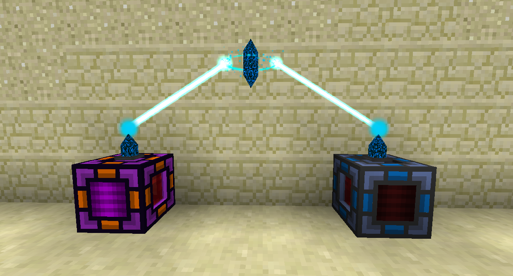
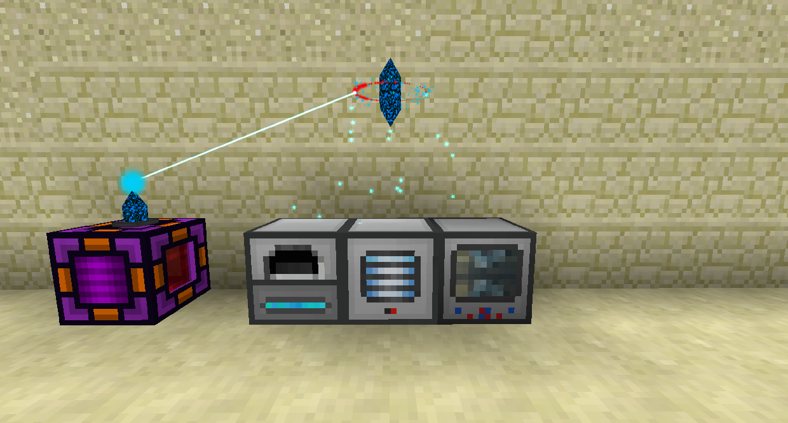

# 能量水晶

能量水晶可以無線傳輸 RF。

您可以使用能量裝置連接器連接水晶。在水晶上潛行右鍵使用水晶綁定器將其綁定到該水晶，然後右鍵單擊您希望它連接到的所有其他水晶。

能量水晶分為三個層級。每一層級都會增加它們可以存儲的 RF 量，以及它們可以擁有的連接數量。即使是基本的水晶也可以傳輸至少25,000 RF/t。

RF 通過能量收發水晶進入並存在於系統中。預設情況下，他們將從他們所在的塊中拉出。空手右擊能量收發水晶，設置為輸出。能量收發水晶具有最少數量的可連接性。

能量中繼水晶的連接數量最多，因此它們應該用於連接收發水晶。

基本無線能量收發水晶可以將 RF 從網絡傳輸到世界上的機器。使用能量裝置連接器將其連接到 RF 來源（能量收發水晶或中繼水晶），然後潛行右鍵單擊您要供電的機器。如果能量只能從機器的側面輸入，請將其綁定到該側面。
