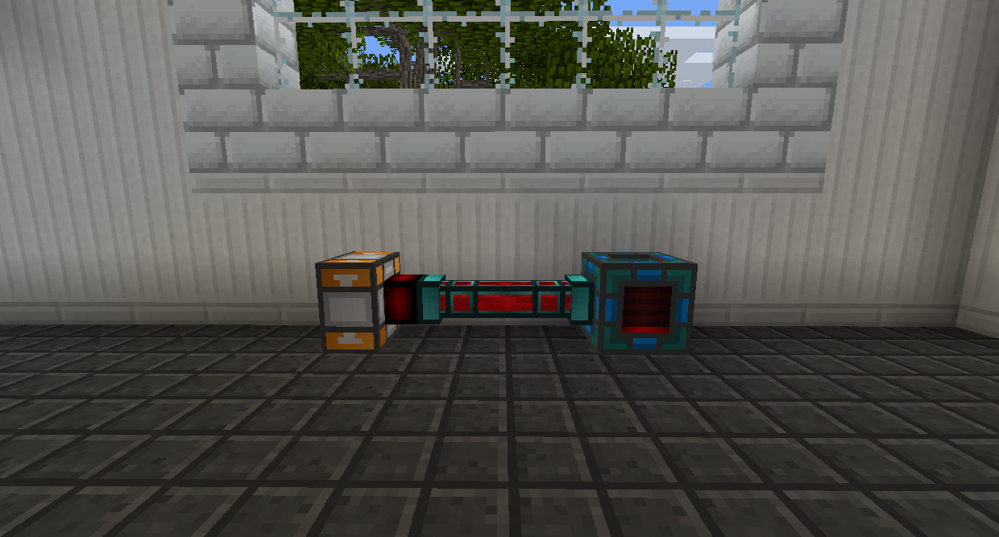

# 能量導管

能量導管用於傳遞能量。

沿著您希望它移動的路徑放置一排能量導管，從源頭到目的地。每條線路可以有多個來源和目的地。您可以使用新月錘切斷不需要的連接。

能量導管只能在給定的時間範圍內承載一定量的 RF。這以 RF/t、RF per Ticks 為單位進行測量。Ticks 是遊戲運行的速度，每秒 20 Ticks，沒有Lag。

鉛石能量管道是最基本的；他們每個連接只能傳輸 1,000 RF/t。每個鉛石能量管道還可以儲存 5,000 RF。

硬化能量管道每個連接可傳輸 4,000 RF/t。每個硬化能量管道還可以儲存 20,000 RF。

紅石能量管道每個連接可以傳輸 9,000 RF/t。每個紅石能量管道還可以儲存 45,000 RF。

信素能量管道每個連接傳輸 16,000 RF/t。每個信素能量管道還可以儲存 80,000 RF。

諧振能量管道每個連接傳輸 25,000 RF/t。每個諧振能量管道還可以儲存 125,000 RF。

凜冰固化能量管道傳輸無限量的 RF/t，僅受來源的推動功率限制。它們沒有任何內部 RF 儲存。

新月錘充當扳手。它可以旋轉大多數方塊，切斷管道連接，如果潛行右鍵單擊，它可以立即破壞管道。