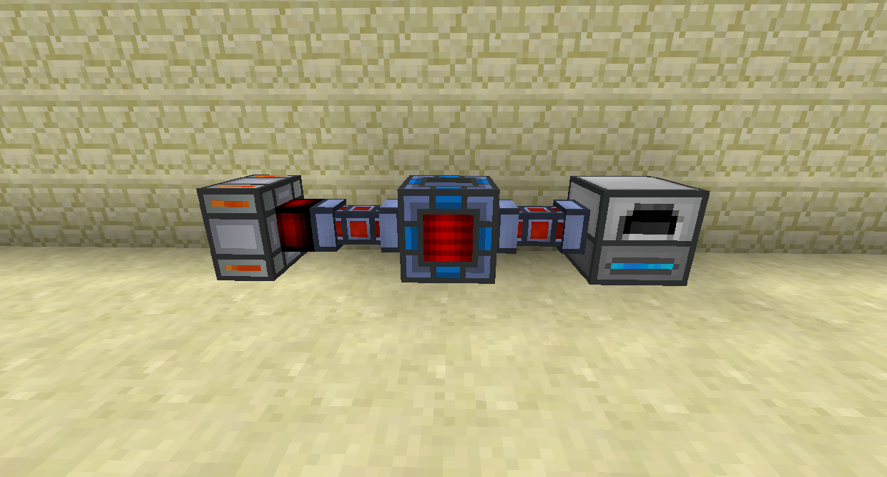
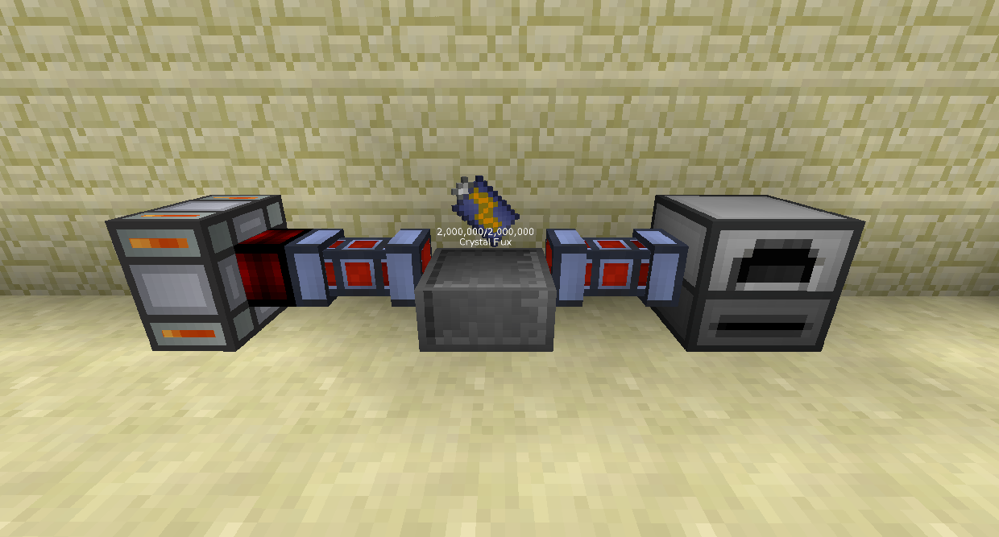
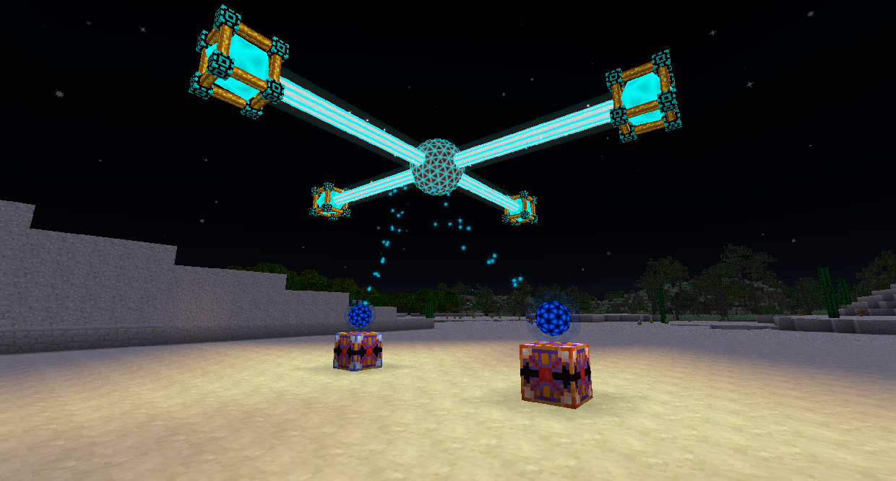
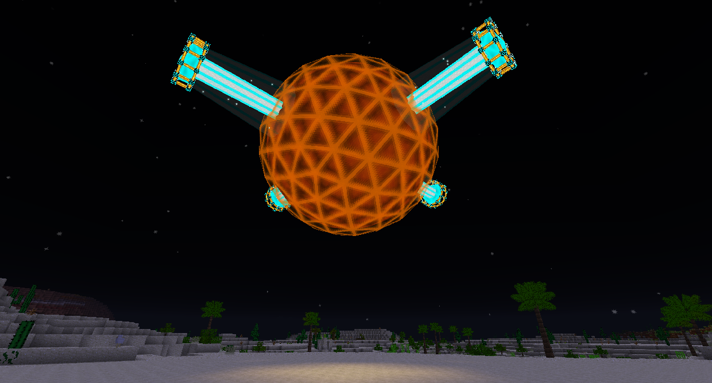

# 能量儲存

僅僅產生和使用電力是不夠的。儲存它也非常重要，以防您偶爾不得不使用比製造更多的RF有幾種方法可以在這個模組包中儲存 RF。

能量單元可以設置為從特定側輸入和輸出。您可以使用升級套件對其進行升級以儲存更多RF。基本能量單元可儲存 2,000,000 RF，最大層可儲存 50,000,000 RF。

電池箱可以為其中的任何電池充電和放電。您可以通過在電池箱上右鍵單擊電池來放入和取出電池。

能量儲存核心是一種多方塊結構，可儲存大量RF。第一層級儲存 45,500,000 RF，最大層級可儲存 9,223,000,000,000,000,000,000 RF。

與能量單元和電池箱相比，能量儲存核心需要更多的工作來設置。將能量儲存核心塊放置在您希望多方塊所在位置的中心，然後在同一 y軸 水平上圍繞它放置 4 個能量核心穩定器。打開能量儲存核心的 GUI，你可以選擇它的層級，你可以打開和關閉建造指南。設置好所有內容後，單擊“啟用”。

要將 RF 輸入和輸出能量儲存核心，請在核心的 16 個方塊內放置一個能量塔，並在其上方或下方放置一塊玻璃，具體取決於塔是在核心下方還是上方。將電源連接到這些能量塔。要在輸入和輸出之間切換，請右鍵單擊球體。
