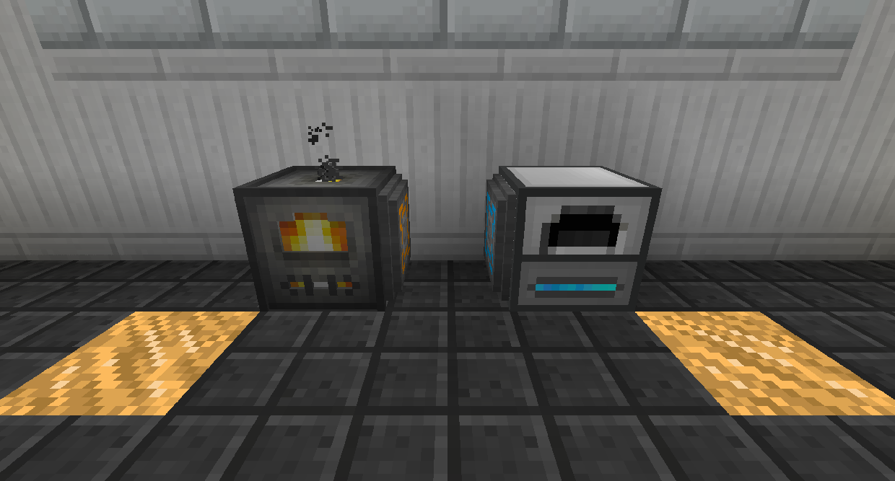
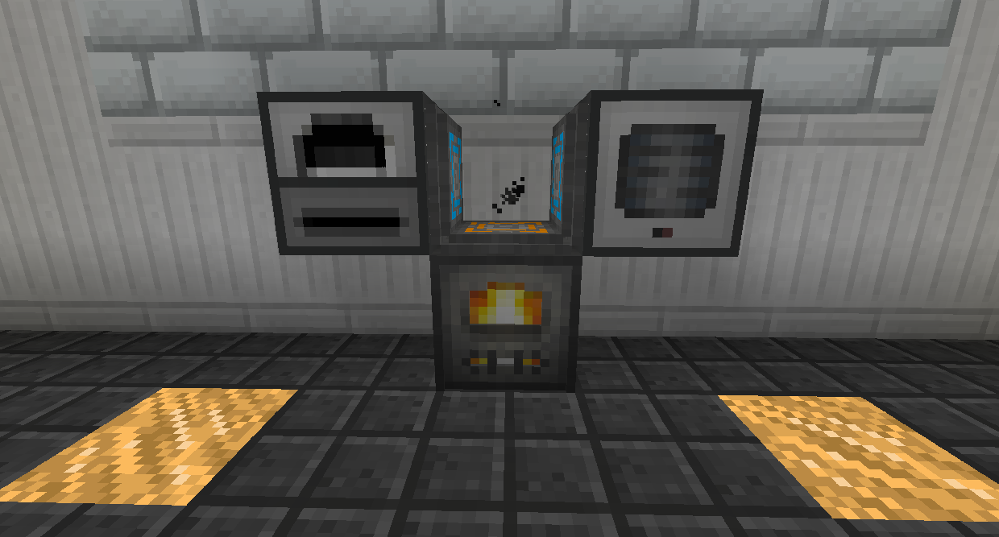
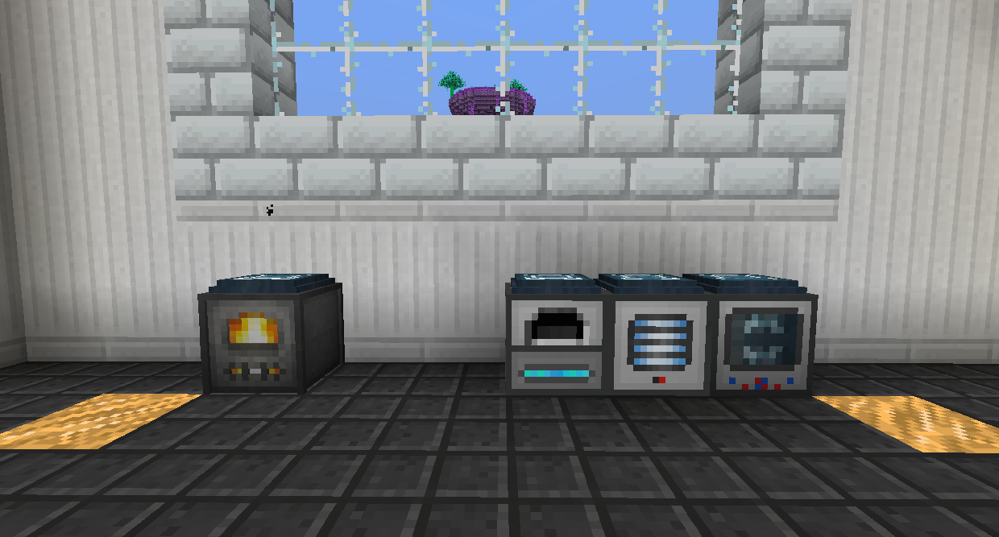
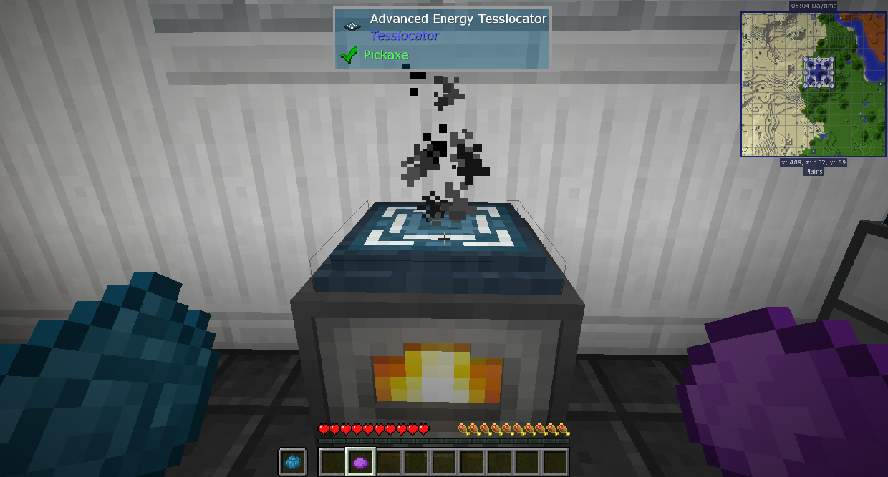

# 能量超轉運體

能量超轉運體分為兩個層級：基礎和進階.

基礎能量超轉運體允許您在極短的距離內移動能量。他們也儲存少量能量。

基礎能量超轉運體可以存儲 32,000 RF，並以 2,048 RF/t 的速度提取能量。

您可以在一個方塊空間中擁有兩個以上的超轉運體。能量將嘗試平均分配。

將超轉運體放置在您要與之交互的每個方塊上的空間中。右鍵單擊可在輸入和輸出模式之間切換。

進階能量超轉運體允許您在任何距離內無線移動能量。

進階能量超轉運體可以以 4,000,000 RF/t 的速度儲存和提取能量。

要將進階能量超轉運體連接在一起（因為它們不再位於同一個方塊空間中），雙手拿著兩個染料並右鍵單擊超轉運體。

要在輸入和輸出模式之間切換，請空手右擊進階能量超轉運體。
