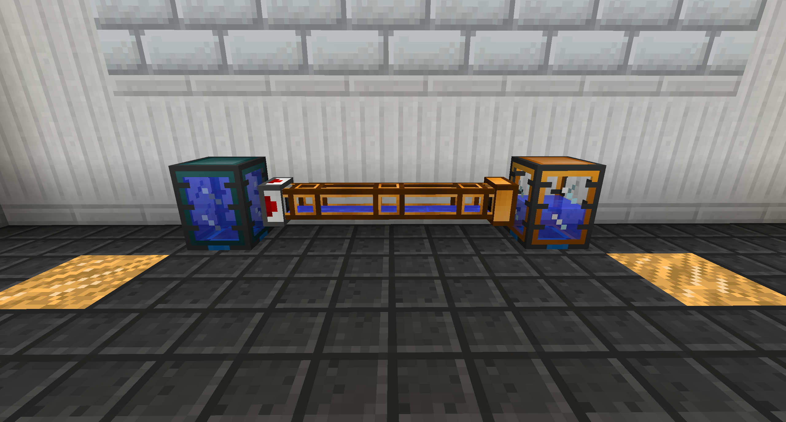

# 流體管道

流體管道用於傳輸流體。

沿著您希望它移動的路徑放置一排流體管道，從源頭到目的地。您可以使用 新月錘切斷不需要的連接。將伺服器放在與來源的連接上。

預設情況下，伺服器只會在給定紅石信號時提取，但您可以將其設置為始終工作。

約束流體管道不能傳輸太熱或太冷的流體，而且速度相當慢。

硬化流體管道可以傳輸所有流體。

信素流體管道可以傳輸所有流體，並且每個連接傳輸 4,000 RF/t。

極速層流體管道是傳輸流體的最快方式之一。當流體被源推入而不是被伺服器拉出時，它們的效果最好。
加壓需要幾秒鐘，但它們將以最大速度每秒傳輸數百桶。

新月錘充當扳手。它可以旋轉大多數方塊，切斷管道連接，如果潛行右鍵單擊，它可以立即破壞管道。
