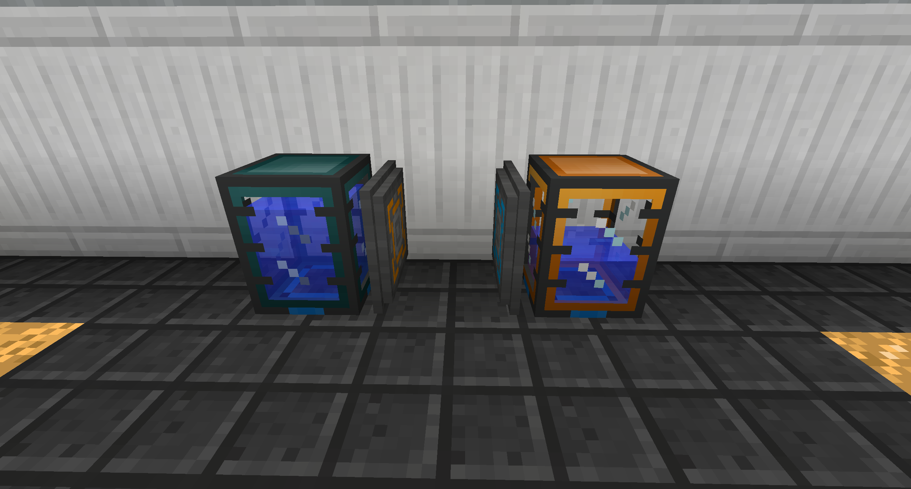
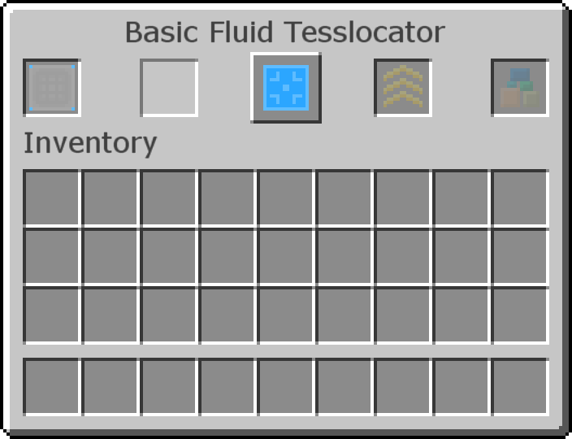

# 流體超轉運體

流體超轉運體允許您在極短的距離內快速移動流體。

流體超轉運體將每 0.8 秒移動 8,000 mB。

將流體超轉運體放置在您要與之交互的每個方塊上相同空間中。打開其 GUI 以更改其設置。

中心按鈕允許您在輸入、輸出和輸入/輸出模式之間切換。流體將從輸出模式方塊移動到輸入模式方塊。

左邊的插槽是過濾器，您可以通過插入填充的桶或項目過濾器來設置過濾器，以將哪些流體可以進入或退出列入白名單。

您可以將螢石插入右側的第一個插槽以使其更頻繁地工作，最多 8 個以使其每Ticks工作一次。

您可以將鑽石插入右側的第二個插槽，使其一次移動更流暢，最多 3 個，使其一次發送 32,000 mB。
