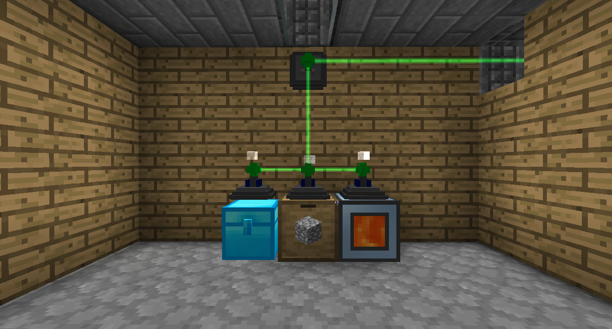

# 物品雷射中繼器

物品雷射中繼器是無線的，可以在您提供物品的情況下盡快傳輸物品。

要連接雷射中繼器，請使用中繼器板手右鍵單擊它們。

物品只能通過物品傳輸介面與存儲網絡進行交互。將物品雷射中繼器放置在要存儲物品的方塊上，然後在要與網絡交互的位置（例如，要插入物品的位置）放置一個物品傳輸介面。在物品傳輸介面上放置另一個物品雷射中繼器，並用中繼器板手將它們全部連接起來。

物品雷射中繼器有一個優先系統。物品將嘗試首先進入**最高**優先級的庫存，如果不能進入該優先級，則會進入下一個最高優先級的庫存。如果有多個優先級相同的庫存，項目將進入最近的一個。

還有進階物品雷射中繼器可以有白名單/黑名單。右鍵單擊以打開其 GUI。在那裡，您可以使用左側的插槽設置允許進入其放置庫存的內容，並且您可以使用右側的插槽設置允許退出的內容。您可以單擊 S 按鈕以快速將列表設置為當前庫存中的任何內容。
