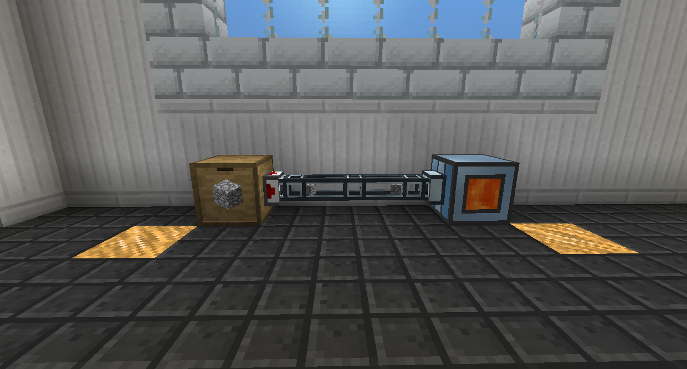

# 物品管道

物品管道用於傳輸物品。

沿著您希望它移動的路徑放置一排物品管道，從來源到目的地。您可以使用新月錘切斷不需要的連接。將伺服器放在與來源的連接上。

預設情況下，伺服器只會在給定紅石信號時提取，但您可以將其設置為始終工作。

基礎物品管道是最基本的，最高物品傳輸最低，每秒半個方塊。

信素物品管道與基礎物品管道相同，但也可以傳輸 4,000 RF/t。

動能物品管道具有更快的傳輸速度，每秒 2 格。

信素推進物品管道的功能與動能物品管道相同，但也可以傳輸 4,000 RF/t。

所有的物品管道都可以連接到不同類型的物品管道。

新月錘充當扳手。它可以旋轉大多數方塊，切斷管道連接，如果潛行右鍵單擊，它可以立即破壞管道。