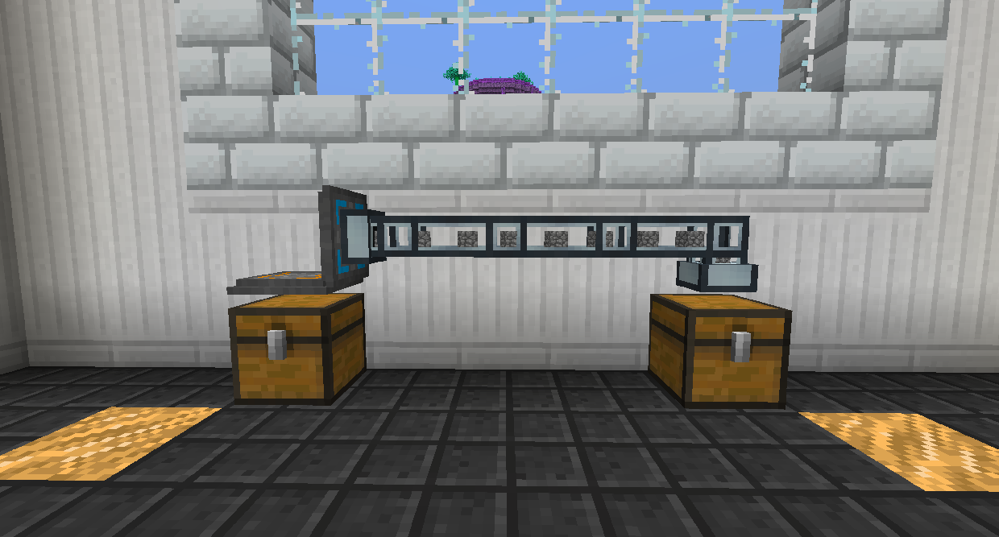

# 物品超轉運體

基礎物品超轉運體允許您在極短的距離內快速移動項目。

基礎物品超轉運體將每 0.8 秒移動 1 組物品，循環遍歷它所放置庫存的每個插槽。這對於同時從同一個庫存中插入和提取物品時非常有用，因此它會移動每個插槽而不僅僅是第一對。

它也適用於物品管道！您可能需要使用新月錘右鍵單擊物品管道才能連接它。

您可以在一個方塊空間中擁有兩個以上的超轉運體。如果不使用過濾器，項目將嘗試平均拆分。

將超轉運體放置在您要與之交互的每個塊上的相同方塊空間中。打開它的 GUI 以更改設置。

中間按鈕允許您在輸入、輸出和輸入/輸出模式之間切換。物品將從輸出模式庫存移動到輸入模式庫存。

左邊的插槽是過濾器，您可以通過插入項目或項目過濾器來設置哪些項目可以進入或退出白名單。

您可以將螢石插入右側的第一個插槽以使其運行速度更快，最多可插入 8 個以使其每Ticks運行一次。

您可以將鑽石插入右側的第二個插槽中，使其一次移動更多組物品，最多 3 個，使其一次發送 4 組物品。
