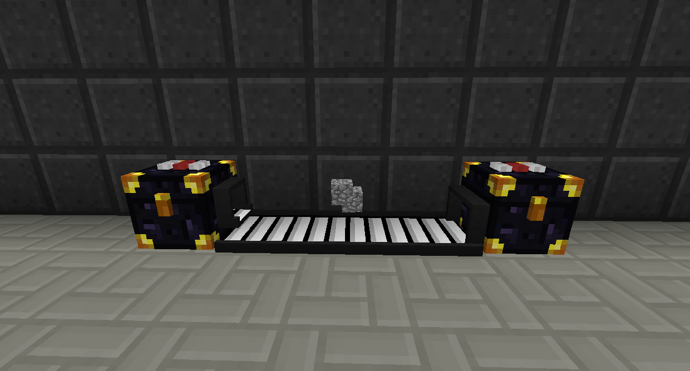
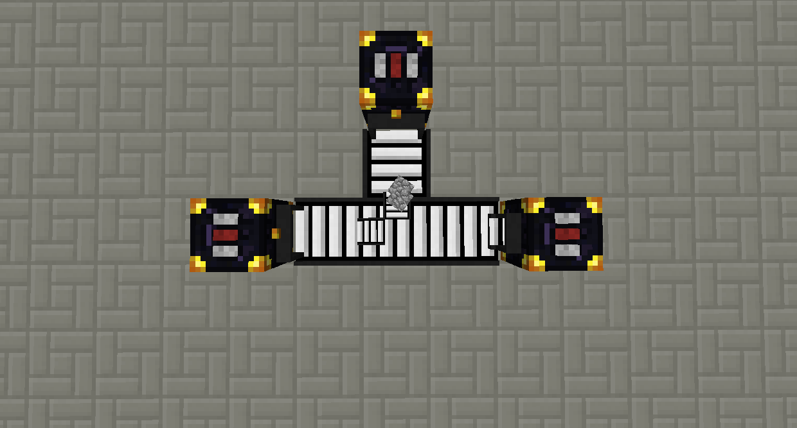
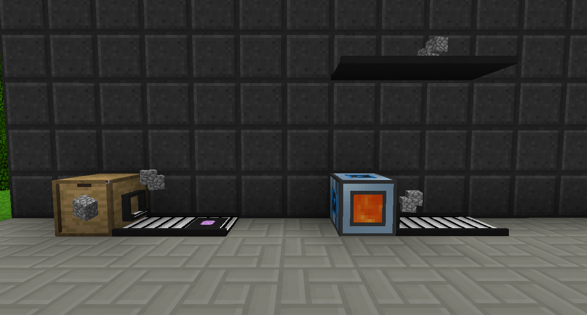
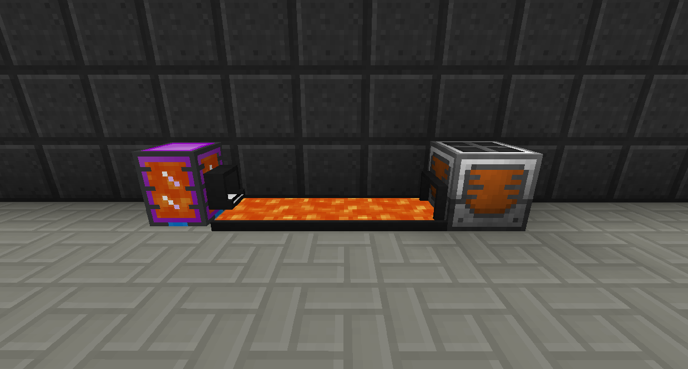

# 傳送帶

傳送帶可以將物品、實體（如生物），甚至流體沿它們所面對的方向移動。

預設情況下，他們唯一要做的就是移動實體。他們不會從庫存中提取或輸入物品。為此，您分別需要提取和輸入輸送機升級。

預設情況下，任何走得太近的玩家都可以撿起傳送帶上的物品。您可以使用塑料片右鍵單擊傳送帶上來升級它們，使其不會被撿起。
你也可以使用螢石來加速它們！

您可以使用其他幾種升級來改變它們的工作方式。

傳送帶叉分升級允許您將輸入的一小部分移動到其他傳送帶上。在您要拆分的傳送帶上，將升級放在您希望它去的所有方向。空手右鍵打開，可以設置那個方向的權重。因此，例如，如果它向兩個方向移動並且它們的權重均為 1，則有 50% 的機會向任一方向移動。如果其中一個的權重為 2，另一個的權重為 1，則第一個有 66% 的機會，第二個有 33% 的機會。

傳送帶投下升級將使傳送帶在其下方投下物品，無論是進入世界還是下方的庫存。您可以打開它以設置允許通過的白名單或黑名單。

傳送帶檢測升級將使傳送帶在實體經過時輸出紅石信號（無論是物品還是生物）。您可以右鍵單擊升級以打開其 GUI，您可以在其中設置項目或生物的黑名單或白名單以將其關閉。要設置生物，請在生物捕捉工具中捕獲一個並將其放入列表中。

傳送帶閃爍傳送升級會將任何經過它的實體（包括生物和玩家）向前和向上傳送指定距離。單擊它以設置其水平和垂直距離，以及可選的白名單/黑名單。它不會傳送流體。

傳送帶彈射升級將通過空中發射在其上的實體。您可以打開它以設置其垂直和水平強度，以及可選的黑名單/白名單。

它們也適用於流體！
