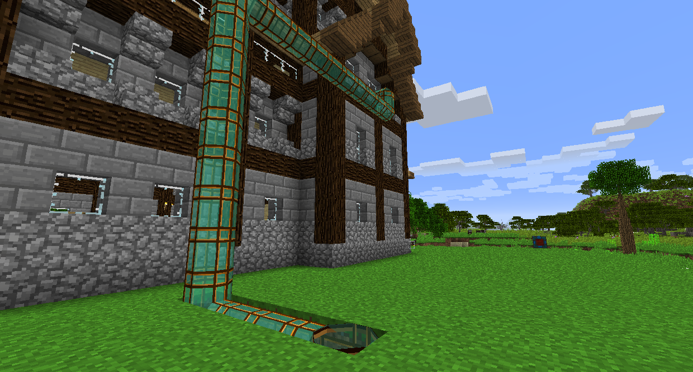
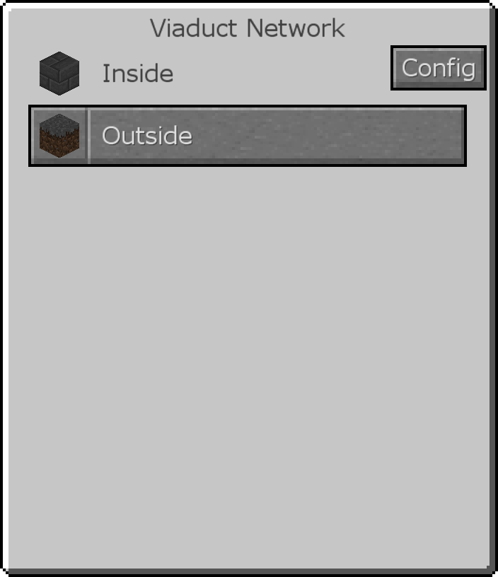
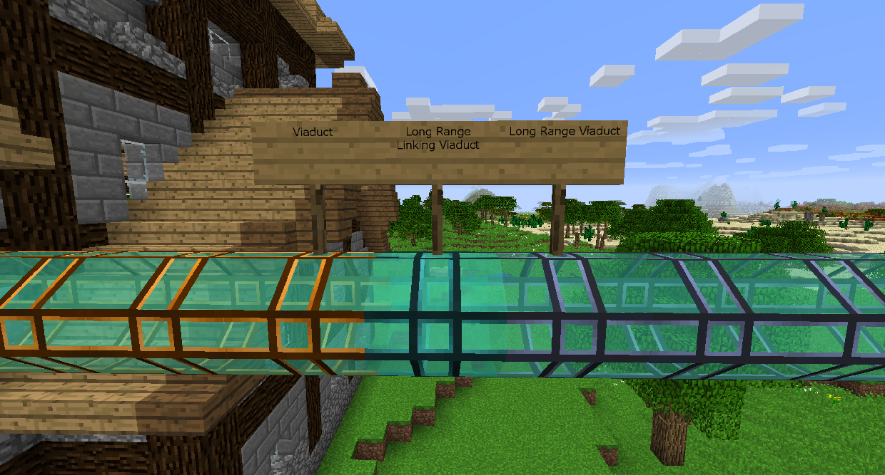
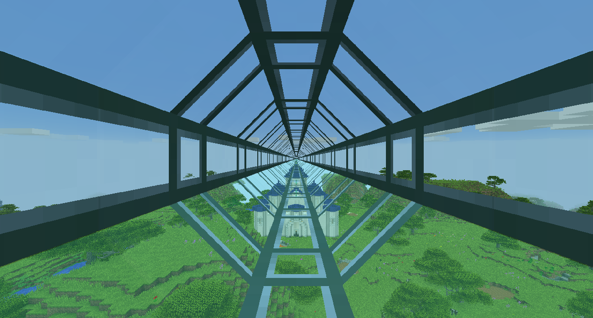

# 旅行管道

與其他管道一樣，您可以傳輸物品、能量和流體，旅行管道可以讓您傳輸自己！玩家以每秒 10 個方塊的速度穿過旅行管道。

沿著您希望玩家旅行的路線放置一條旅行管道路徑。用新月錘右鍵單擊旅行管道將其打開，允許玩家通過它進出其他開口。

單擊開口並選擇前往目的地，只要它在同一個旅行管道系統中即可。

單擊 GUI 中的“配置”按鈕以更改該開口的名稱和圖示。

遠程旅行管道的速度是普通旅行管道的兩倍，這使得它們非常適合長距離移動。
您不能打開遠程旅行管道，也不能有交叉路口。放置一條正好有兩個目的地的線路，並在兩端放置一個遠程連接旅行管道。右鍵單擊連接旅行管道以完成該段。

將旅行管道連接到遠程連接旅行管道，它們將按預期運行。如果您選擇遠程旅行管道另一端的目的地，您將被運送到遠程連接旅行管道，然後通過它們到達另一端，然後從那裡您將被運送到您的目的地。

