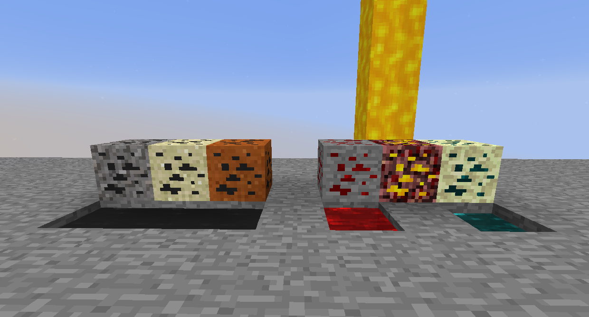
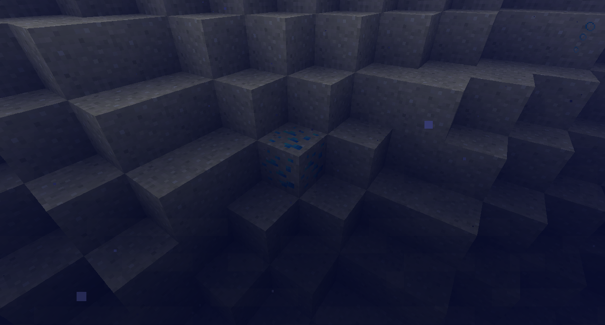

# 礦物
模組添加了很多額外的礦石。
您可以在物品欄或此頁面中對它們按 R 以查看它們生成的位置。

## 熱力基本-Thermal Foundation
熱力基本添加了這些礦石：

它還添加了這些礦物，當它們被破壞時會暫時產生一些它們的液體。

油砂和油頁岩會掉落瀝青和少量原油。

不穩紅石礦石會掉落不穩紅石絡合物和一滴不穩熔融紅石。

充能地獄岩會掉落充能絡合物和一滴充能液態螢石（它向上流動並為你提供跳躍加速、速度和發光）。

諧振終界礦石會掉落諧振終界絡合物和一滴諧振熔融終界珍珠（它會隨機將你傳送到 8 格內）。

## 匠魂-Tinkers' Construct
匠魂將這些礦石添加到地獄。

## 星輝魔法-Astral Sorcery
星輝魔法添加了海藍寶石砂岩，它可以在海灘的水下生成。

## 實用擴展-Actually Additon
實用擴展添加了黑石英礦石
